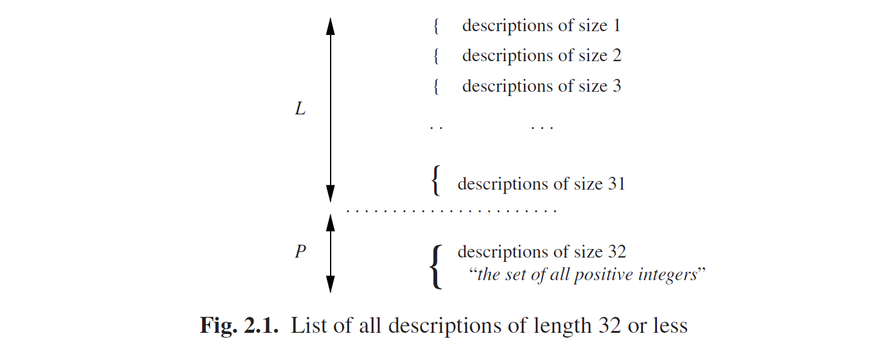
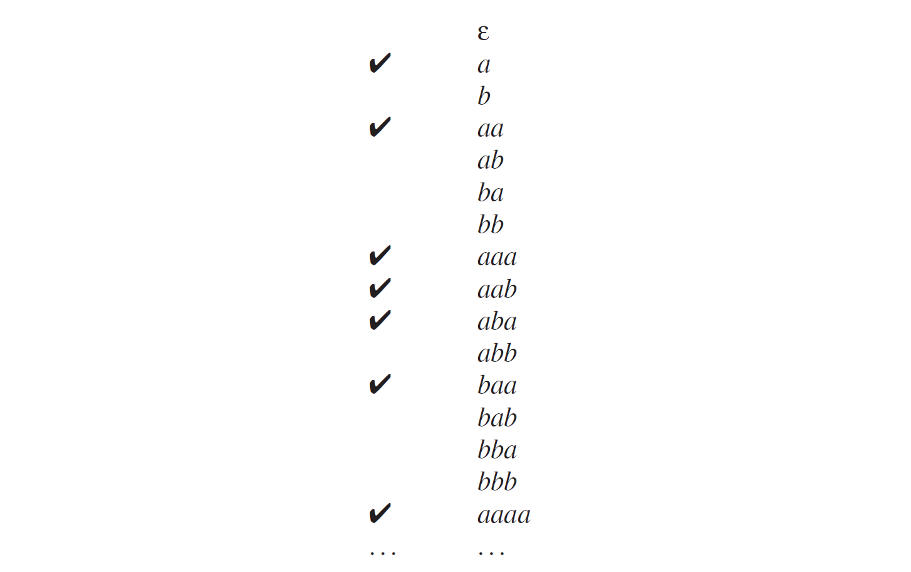

# 2.1.3 无限集带来的问题

上述将语言定义为序号序列的无限集，以及将语法定义为构造句子的配方的定义，引出了两个令人尴尬的问题：

1.一个有限的配方如何能产生无限的句子集呢？

2.如果一个句子只是一个序列而没有结构，或者如果一个句子，可以通过其结构推导出其他的意义，那我们该如何理解这个句子呢？

这两个问题有一个漫长而复杂的答案，不过确实是有答案的。我们先解决第一个问题，然后在带着第二个问题去阅读本书的主体部分。

### 2.1.3.1 有限描述的无限集

其实从一个有限的描述中得到一个无限集，并没有什么问题：“所有正整数集合”是一个非常有限的描述，但描述的却是一个无限集合。不过，还是有一些令人不安的想法，所以我们把问题换一个说法：“所有的语言都能用有限的描述来说明吗？” 正如上文暗示的，答案是“不行”，不过证据却不是无关紧要的。实际上是非常有趣并且有名气的，如果不展示一下或者至少大致的介绍一下，将会是一个遗憾。

### 2.1.3.2 枚举描述

证明是基于两个意见和一个技巧之上的。第一个意见是，描述是可以列举的并且有一个数据。如下所示。首先，找出全部大小为1的，也就是那些上都只有一个字母的，然后将他们按字母顺序排序。这是我们列表的开头。基于这个，实际上我们在接受一种描述，长度为1的描述可能是0，或27（所有字母+空格），或者95（所有可打印的ASCII字符）或者其他类似的；具体是什么对下面的讲解都不重要。

第二步，我们找出长度为2的并将他们按照字母顺序排序，然后将他们放在列表中的第二块；然后是长度为3的，长度为4的等等等等，都这样做。每一个描述都这样在列表中获得一个位置。例如“所有正整数的集合（the set of all positive integers）”这个描述，集合大小为32个字符（英文），不算引号。若要查找其在列表中的位置，我们要先计算有多少少于32字符的描述，称为L。然后我们必须生成所有长度为32的描述，对他们进行排序，然后确定我们的描述在其中的位置，称为P，然后把L和P加起来。这肯定会是一个巨大的数字[^1]，不过这就能确保我们的描述处于这个完整定义的列表中了；见图Fig.2.1。

有两件事情应该指出。第一，只是根据字母列出全部描述，而不指出其长度将不会起作用：已经有很多以“a”开头的描述，以及没有以其他字母开头的描述，将会在列表中获取一个位置。第二，其实没有必要列出全部的描述。这只是一个思想实验，使我们在无法亲自检测结构的情况下，能有一个方式来检测一个行为体系并得出结论。 

此外，列表中会有一些荒谬的描述；不过这对我们的论点来说是无关紧要的。重点是有用的描述都在列表中，以上描述能确保这一点。

[^1]: 一些计算表明，在ASCII-128假设下，这个数字是248 17168 89636 37891 49073 14874 06454 89259 38844 52556 26245 57755 89193 30291，或者大致是2.5× $$10^{67}$$。

### 2.1.3.3 语言，无限的比特串

我们知道，在语言中单词（句子）被视为一组有限的符号集；这个集合被称为“字母表”。我们假设字母表中的字母是有序的。那么语言中的单词也是有序的。我们用字母Σ来表示字母表。

现在最简单的语言就是，使用字母表Σ中的字母组成了所有单词的语言。通过字母表Σ = {a,b}，我们获得了一门语言{ , a, b, aa, ab, ba, bb, aaa, . . . }。我们应该把这个语言称为Σ*，稍后再说为什么这么称呼；暂时这只是一个名字。

上面用Σ*标记的集合，以“ { , a,”为开头，很明显的一个结构；这个语言的第一个单词是一个空的单词，<u>这个单词由A集的大小为0的和B集的大小为0的单词构成</u>。没有理由拒绝这个空单词的到来，但如果写下来又很容易被忽视掉，所以我们把这个空单词写成ε(小写的Σ)，不理睬字母表。所以，Σ* = { ε, a, b, aa, ab, ba, bb, aaa, . . . }。在一些自然语言中，动词“to be”的现在时态就是一个空单词，赋予“I student”这个句子以“I am a student”的意义。俄语和希伯来语就是很好的例子。

因为字母表Σ中的符号是有顺序的，我们可以列出语言Σ*中的单词，使用上一节中说到的方法：第一，将所有大小为0的单词排序；然后大小为1的单词排序；然后后面依次。实际上我们已经在Σ*中这样做了。

语言Σ*有一个有趣的地方，就是所有使用字母表Σ的语言，都是它的子集。这意味着，在Σ的基础上创建一门不那么复杂的语言，称做L，那我们就能遍历Σ*列表中的所有单词，然后在属于L的单词上做一个标记。这样就能把L中的全部单词都包括了，因为Σ*本来就包括了所有可能属于L的单词。

假设我们的L语言是“一组相比于B集，包含更多A集的单词的集合”。L就是这样的{a, aa, aab, aba, baa, . . . }。那Σ*列表的开头部分就是下面这样的：

给定一个排序过的字母表，空格和有标记的部分就完全足够识别和描述一个语言了。为了方便，我们将空格写作0，将有标记的写作1，就像计算机中的位（bits）一样，那我们现在就可以把L写成L =  0101000111010001· · ·（而Σ* = 1111111111111111· · · ）。需要指出的是这适用与任何语言，比如一门正式语言L，一门编程语言Java，一门自然语言英语。在英语中，像标记为“1”这样的是非常稀少的，因为几乎没有任何一个任意序列的单词组合会是一个有意义的句子（同理，没有任何一个任意序列的字母组合是一个有意义的单词，取决于我们怎么处理“句子/单词”和“单词/字母”这两个层面）。

### 2.1.3.4 对角化

上一节将无限位字符串0101000111010001· · ·和“一组相比于B集，包含更多A集的单词的集合”这个描述联系在一起。同样，我们可以将这种位字符串附加到所有的描述上。有些描述可能不足以产生一门语言，这种情况下我们可以将任意无限位字符串附加给它。既然所有的描述都可以有一个单一的被编号的列表，那么我们就有了下面的图：

左侧是描述，右侧是描述对应的语言。但是现在我们说很多已经存在的语言却不存在于上述列表中：上述列表离完整还很远，虽然列表的描述是很完善了。 为了证明这点，我们将使用Cantor的对角化过程（“Diagonalverfahren”）。

想象一下，语言C = 100110· · ·，它的第n阶位并不等于描述#n中描述的第n阶位。语言C的第一个比特位为1，因为描述#1的第一个比特位是0；第二位是0，因为描述#2的第二位是1，等等。C是由语言字段的对角线的左上方到对角线的右下方，然后复制我们遇到的每一个位的反向位组成。这就是图Fig 2.2（a）中对角线。那语言C就不能存在于列表中！它不能在行1中，因为它的第一位不同于（应该说，被弄得不同）行1的第一位，而且通常来说，它也不能在行n中，因为第n位不同于行n的第n位，通过定义可以得出。

所以，尽管我们已经详尽无遗的列举了所有可能的有限描述，那也至少会有一种语言的描述不在列表中。但实际上，有更多的语言不在列表中。例如，构造一个语言，它的第n+10位于描述#n的第n+10位不同。这个语言再次不存在于列表中因为每一个n>0的位都不同于行n中第n+10位。但是这意味着1到9位没起作用，可以任意替代，如图Fig 2.2（b）所示；这将生成另外2$${^9}$$ = 512种语言，且都不在列表种。而且我们能做的更好！假设我们构建了一门语言，它的第2n位与描述#n（c）的第2
n位不同。明显它也不在原列表中，但现在每一个基数位都是左侧未指定的部分，而且可以随意选择！这使得我们可以自由的创建无限数量的语言，而它们都没有有限的描述；见图Fig 2.2中的斜对角线。简而言之，对于每一种可以描述的语言来说，还有更多的不可描述的语言。

关于对角化技术，在理论计算机科学中的很多书中有更正式的讲解；例如Rayward-Smith [393, pp. 5-6], 或者 Sudkamp [397, Section 1.4]。

### 2.1.3.5 讨论

上面的论证展示给我们几件事情。第一，这表明了把语言当作一个正式对象的力量。虽然上述大纲明显还需要相当大的扩增和证据，来证明其资质（为了这个，却仍需加以澄清）为什么上述定义语言C的解释，本身不在描述列表中；见问题2.1，这让我们能深入了解其属性，或者评估其属性。

第二，这表明我们只能描述所有可能语言的很微小的一部分子集（甚至都不是一小部分）：语言的数量是无限的，且远远超出我们能弄清的范围。

第三，我们已经证明，虽然有无穷多的描述和无限多的语言，然而描述和语言的范围却并不相等，后者要远大于前者。这些无穷被Cantor称为ℵ0和ℵ1，而上述只是他对ℵ0 < ℵ1进行证明的一个特殊例子。