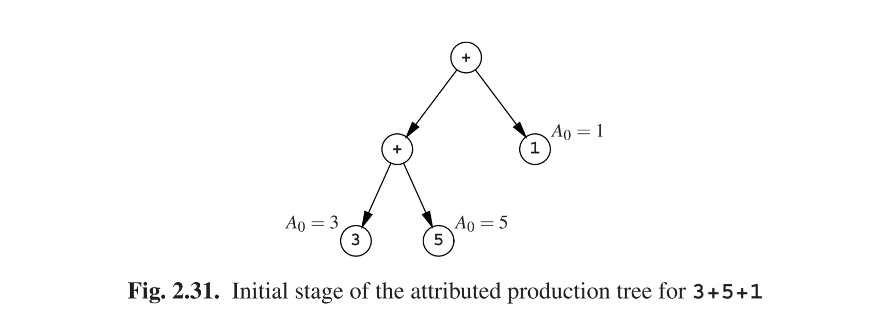

# 2.11.1 属性语法

属性语法中的语义子句假设生成树的每一个节点都有空间给一个或多个属性，这些属性就是放在生成树节点上的值（数字，字符串或其他东西）。为简单起见，我们限定这个属性语法每个节点只有一个属性。这种语法中一个规则的语义子句包含一个公式，用以计算一个规则(由生成树的节点展示)中的一些非终结符着这个规则的其他终结符。这些语义动作之和规则的本地属性关联：整体的语义由所有本地计算的结果构成。

如果规则*R*的语义子句计算*R*左侧的属性，这个属性会派生。如果它计算*R*的右侧非终结符的属性，例如*A*，那这个属性就被*A*继承。派生属性也被称为“合成属性”。我们例子的属性语法是：

花括号中给出了语义子句。*A0*是左侧的（派生）属性；*A1*，...，*An* A0 is the (derived) attribute of the left-hand side; A1, ..., An are the attributes of the members of the right-hand side. Traditionally, terminal symbols in a right-hand side are also counted in determining the index of A, although they do not (normally) carry attributes; the Digit in rule 2 is in position 3 and its attribute is A3. Most systems for handling attribute grammars have less repetitive ways to express rule 3a through 3j.

The initial production tree for 3+5+1 is given in Figure 2.31. First only the attributes for the leaves are known, but as soon as all attributes in a right-hand side of a production rule are known, we can use its semantic clause to compute the attribute of its left-hand side. This way the attribute values (semantics) percolate up the tree, finally reach the start symbol and provide us with the semantics of the whole sentence, as shown in Figure 2.32. Attribute grammars are a very powerful method of handling the semantics of a language. They are discussed in more detail in Section 15.3.1.

