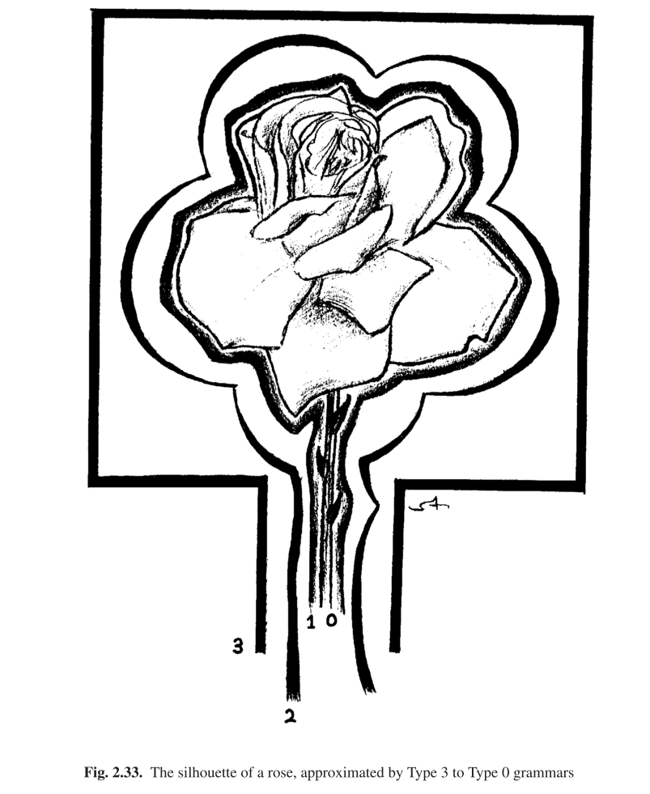

# 2.12 A Metaphorical Comparison of Grammar Types

Text books claim that “Type n grammars are more powerful than Type n+1grammars, for n = 0,1, 2”, and one often reads statements like “A regular (Type 3) grammar is not powerful enough to match parentheses”. It is interesting to see what kind of power is meant. Naively, one might think that it is the power to generate larger and larger sets, but this is clearly incorrect: the largest possible set of strings, Σ∗,is easily generated by the Type 3 grammar

**Ss --->[Σ]S| ε**

where [Σ] is an abbreviation for the symbols in the language. It is just when we want to restrict this set, that we need more powerful grammars. More powerful grammars can define more complicated boundaries between correct and incorrect sentences. Some boundaries are so fine that they cannot be described by any grammar (that is, by any generative process).

This idea has been depicted metaphorically in Figure 2.33, in which a rose is approximated by increasingly finer outlines. In this metaphor, the rose corresponds to the language (imagine the sentences of the language as molecules in the rose); the grammar serves to delineate its silhouette. A regular grammar only allows us straight horizontal and vertical line segments to describe the flower; ruler and T-square suffice, but the result is a coarse and mechanical-looking picture. A CF grammar would approximate the outline by straight lines at any angle and by circle segments; the drawing could still be made using the classical tools of compasses and ruler. The result is stilted but recognizable. A CS grammar would present us with a smooth curve tightly enveloping the flower, but the curve is too smooth: it cannot follow all the sharp turns, and it deviates slightly at complicated points; still, a very realistic picture results. An unrestricted phrase structure grammar can represent the outline perfectly. The rose itself cannot be caught in a finite description; its essence remains forever out of our reach.

A more prosaic and practical example can be found in the successive sets of Java[^1] programs that can be generated by the various grammar types.

- The set of all lexically correct Java programs can be generated by a regular grammar. A Java program is lexically correct if there are no newlines inside strings, comments are terminated before end-of-file, all numerical constants have the right form, etc.

- The set of all syntactically correct Java programs can be generated by a contextfree grammar. These programs conform to the (CF) grammar in the manual.

- The set of all semantically correct Java programs can be generated by a CS grammar. These are the programs that pass through a Java compiler without drawing error messages.

- The set of all Java programs that would terminate in finite time when run with a given input can be generated by an unrestricted phrase structure grammar. Such a grammar would, however, be very complicated, since it would incorporate detailed descriptions of the Java library routines and the Java run-time system.

- The set of all Java programs that solve a given problem (for example, play chess) cannot be generated by a grammar (although the description of the set is finite).

[^1]: We use the programming language Java here because we expect that most of our readers will be more or less familiar with it. Any programming language for which the manual gives a CF grammar will do.