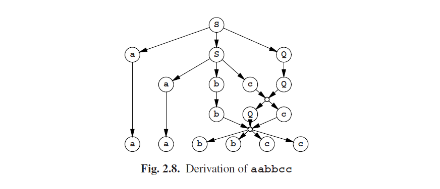

# 2.3.1 1型语法

0型语法的特征是，它包含一条规则是可能将任意数目（非零）的符号转化为任意数目（可能为零）的符号。例如：

**, N E ---> and N**

如上三个符号被两个符号取代。通过限制这种自由，我们引入1型语法。奇怪的是关于1型语法的，直觉上完全不同的两个定义，却很容易被证明是相同的。

### 2.3.1.1 1型语法的两个类型

一种语法是*1型单调*，如果它不包含规则，左侧的符号比右侧符号更多。例如，禁止这个规则 **, N E ---> and N**.

一种语法是*1型上下文相关*，如果所有的规则都是上下文相关。一个规则是*上下文相关*，如果左侧只有一个符号（非终结符）被其他符号替代，然后我们把右侧的符号都找到且没有损坏且按顺序放置。例如：

**Name Comma Name End ---> Name and Name End**

这就说明这个规则

**Comma ---> and**

可能适用，如果左侧文字是**Name**而右侧文字是**Name End**。上下文本身不受影响。替代者必须是至少一个符号长。这意味着上下文相关语法总是单调的；见2.5节。

这里是**t,d&h**例子的一个单调语法。在书写单调语法时，必须要小心绝不能多生成一个后面本来就会生成的符号。我们通过将结束标记纳入最右侧的名字来避免需要删除键鼠标记：

当**EndName**是一个单独的符号时。

这就是它的一个上下文相关语法。

请注意，我们需要一个额外的非终结符逗号来产生终结符，并在正确的上下文中。

单调语法和上下文相关语法时同样强大的：每一种可以由单调语法生成的语言，都可以由上下文相关语法生成，反之亦然。但它们都不如0型语法强大，也就是说，可以由0型语法可以生成任何一种1型语法都无法生成的语言。但奇怪的是没有这样的语言被人们所知道。虽然0型语法和1型语法的区别是基础层面的，而且不是Chomsky先生一时兴起的，它们之间差异的语法太复杂而不能写下来；而只能证明这差异的存在（例如Hopcroft and Ullman [391, pp. 183-184], 或 Révész [394, p. 98]）。

当然任何类型的1型语法都属于0型语法，因为1型语法是在0型语法的基础上，增加了一些限制条件推导而来。但如果将1型语法也称为0型语法就会引起混乱；就像把猫叫做哺乳动物一样：正确但不精确。一种语法是按照最小适用类型来命名的（也就是，最高类型数）。

我们可以看到语言**t,d&h**，先由0型语法生成，也可以由1型语法生成。我们应当也能知道同样还有2型和3型语法适用，但没有4型语法。所以我们说语言**t,d&h**是一种3型语言，经过限制层数最多（最简单和适合）的语法之后。关于此的一些推论：一个n型语言可以由n型语法或更强大的语法生成，但不能由比较弱小的n+1语法生成；以及：如果一种语言是由n型语法生成，那并不意味着（更弱小的）n+1型语法无法生成它。**t,d&h**语言的0型语法是一个严格的例子，而只是为了演示目的。

### 2.3.1.2 构建一个1型语法

1型语法的标准例子就是包含相同数目的a,b,c的集合，按照以下顺序：

为了完整起见，以及展示1型语法如何被书写出来，如果够聪明的话，我们现在应该得出这个玩具语言的语法。从最简单的例子开始，我们有了以下规则：

0. **S ---> abc**

获得了S的一个实例，我们可能会想要在开头追加更多的a；如果我们想要记住已经有多少了，那同时我们就应该附加一点东西在结尾处，而且不能是一个b或者c。我们应该使用一个目前未知的符号Q。追加后的规则如下：

1. **S ---> aSQ**

如果我们用该规则，例如，使用三次，我们就得到下列句子形式：

**aaabcQQ**

现在，若要从这中间获得**aaabbbccc**，每一个Q必须等同于一个b和一个c，如预期，但我们不能这么写：

**Q ---> bc**

因为这会导致第一个c后面是b。因此，如果限定更换只允许在左边是b右边是c的情况下发生，那上述规则就是可行的。新插入的bc就不会造成影响，如下：

2. **bQc ---> bbcc**

不过，我们不能应用此规则，因为通常Q是在c的右边。可以通过允许Q向左跳过一个c来纠正：

3. **cQ ---> Qc**

现在，我们可以完成我们的推导：

应该指出的是，上述推导只显示语法能生成正确的字符串，读者需要说服自己，语法不会生成别的东西或不正确的字符串（问题2.4）。

语法总结为了图Fig 2.7。因为a3b3c3的推到图已经相当笨拙，

所以图Fig 2.8给出了a2b2c2的推到图。

语法是单调的，因此属于1型。可以证明这个语言不符合2型；见2.7.1节。

虽然只有上下文相关的1型语法拥有被称为上下文相关语法（CS语法）的权利，但这个名字经常被使用在单调1型语法上。对于单调语法没有标准缩写，但MT可以用来代替。