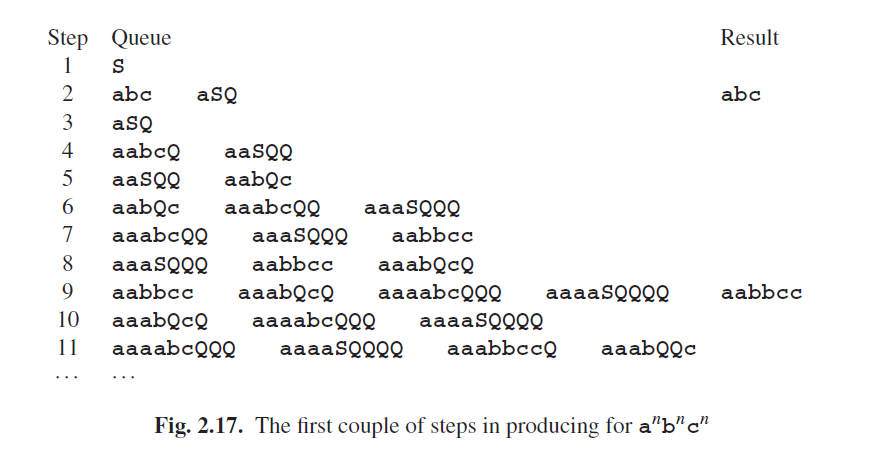

# 2.4.1 短语结构案例

Until now we have only produced single sentences from our grammars, in an ad hoc fashion, but the purpose of a grammar is to generate all of its sentences. Fortunately there is a systematic way to do so. We shall use the anbncn grammar as an example. We start from the start symbol and systematically make all possible substitutions to generate all sentential forms; we just wait and see which ones evolve into sentences and when. Try this by hand for, say, 10 sentential forms. If we are not careful, we are apt to only generate forms like aSQ, aaSQQ, aaaSQQQ, . . . , and we will never see a finished sentence. The reason is that we focus too much on a single sentential form: we have to give equal time to all of them. This can be done through the following algorithm, which keeps a queue (that is, a list to which we add at the end and remove from the beginning), of sentential forms.

Start with the start symbol as the only sentential form in the queue. Now continue doing the following:

- Consider the first sentential form in the queue.
- Scan it from left to right, looking for strings of symbols that match the left-hand side of a production rule.
- For each such string found, make enough copies of the sentential form, replace in each one the string that matched a left-hand side of a rule by a different alternative of that rule, and add them all to the end of the queue.
- If the original sentential form does not contain any non-terminals, write it down as a sentence in the language.
- Throw away the original sentential form; it has been fully processed.

If no rule matched, and the sentential form was not a finished sentence, it was a blind alley; they are removed automatically by the above process and leave no trace.

Since the above procedure enumerates all strings in a PS language, PS languages are also called recursively enumerable sets, where “recursively” is to be taken to mean “by a possibly recursive algorithm”.

The first couple of steps of this process for our anbncn grammar from Figure 2.7 are depicted in Figure 2.17. The queue runs to the right, with the first item on

the left. We see that we do not get a sentence for each time we turn the crank; in fact, in this case real sentences will get scarcer and scarcer. The reason is of course that during the process more and more side lines develop, which all require equal attention. Still, we can be certain that every sentence that can be produced, will in the end be produced: we leave no stone unturned. This way of doing things is called breadth-first production; computers are better at it than people.

It is tempting to think that it is unnecessary to replace all left-hand sides that we found in the top-most sentential form. Why not just replace the first one and wait for the resulting sentential form to come up again and then do the next one? This is wrong, however, since doing the first one may ruin the context for doing the second one. A simple example is the grammar

First doing A--->b will lead to a blind alley and the grammar will produce nothing. Doing both possible substitutions will lead to the same blind alley, but then there will also be a second sentential form, ac. This is also an example of a grammar for which the queue will get empty after a (short) while.

If the grammar is context-free (or regular) there is no context to ruin and it is quite safe to just replace the first (or only) match.

There are two remarks to be made here. First, it is not at all certain that we will indeed obtain a sentence for all our effort: it is quite possible that every new sentential form again contains non-terminals.We should like to know this in advance by examining the grammar, but it can be proven that it is impossible to do so for PS grammars. The formal-linguist says “It is undecidable whether a PS grammar produces the empty set”, which means that there cannot be an algorithm that will for every PS grammar correctly tell if the grammar produces at least one sentence. This does not mean that we cannot prove for some given grammar that it generates nothing, if that is the case. It means that the proof method used will not work for all grammars: we could have a program that correctly says Yes in finite time if the answer is Yes but that takes infinite time if the answer is No. In fact, our generating procedure above is such an algorithm that gives the correct Yes/No answer in infinite time (although we can have an algorithm that gives a Yes/Don’t know answer in finite time). Although it is true that because of some deep property of formal languages we cannot always get exactly the answer we want, this does not prevent us from obtaining all kinds of useful information that gets close. We shall see that this is a recurring phenomenon. The computer scientist is aware of but not daunted by the impossibilities from formal linguistics.

The second remark is that when we do get sentences from the above production process, they may be produced in an unexploitable order. For non-monotonic grammars the sentential forms may grow for a while and then suddenly shrink again, perhaps even to the empty string. Formal linguistics proves that there cannot be an algorithm that for all PS grammars produces their sentences in increasing (actually “non-decreasing”) length. In other words, the parsing problem for PS grammars is unsolvable. (Although the terms are used interchangeably, it seems reasonable to use “undecidable” for yes/no questions and “unsolvable” for problems.)