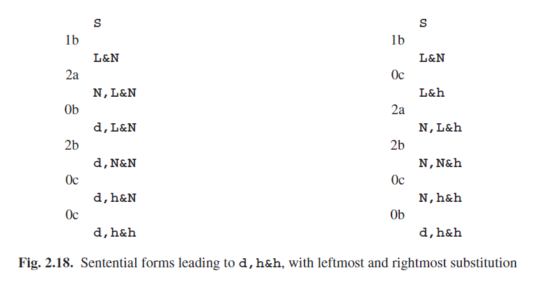
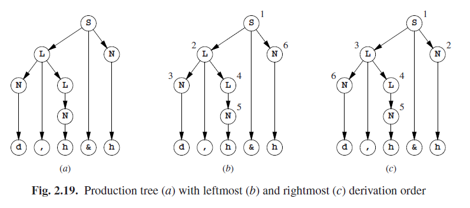

# 2.4.3 CF案例

当我们通过CF语法生成句子时，很多事情都简单很多。虽然我们的语法可能永远不会生成句子依旧有可能发生，不过我们现在可以事先进行检测，如下。首先，扫描语法以找出所有的非终结符，其对应右侧拥有终结符或为空的。这些非终结符确保能生成东西。现在再次扫描找到对应右侧只有唯一终结符的非终结符，这些非终结符确保能生成东西。这将给我们新的保证能生成东西的非终结符。重复这个过程直到不在有新的非终结符产生。如果按这种方式始终找不到起始符号，那这个语法将不会生成什么了。

此外我们已经看到如果语法是CF形式的，我们就能每次重写最左侧的非终结符（直到我们重写了所有的可选项）。当然我们也可以一直重写最右侧的非终结符。这种方法类似但也有不同。通过下面的语法：

让我们跟随句子形式历险，而这将最终导致**d,h&h**。虽然这将经历几次生成队列，但我们在这里只描述对它做了哪些改变。图Fig 2.18展示了句子形式最左侧或最右侧的替换，根据涉及到的规则和备选项；例如（1b）表示规则1备选项b，第二个备选项。

生成规则使用的序列与我们所期望的不同。 Of course in grand total the same rules and alternatives are applied, but the sequences are neither equal nor each other’s mirror image, nor is there any other obvious relationship. Both sequences define the same production tree (Figure 2.19(a)), but if we number the non-terminals in it in the order they were rewritten, we get different numberings, as shown in (b) and (c).

The sequence of production rules used in leftmost rewriting is called the leftmost derivation of a sentence. We do not have to indicate at what position a rule must be applied, nor do we need to give its rule number. Just the alternative is sufficient; the position and the non-terminal are implicit. A rightmost derivation is defined in a similar way.

A leftmost production step can be indicated by using an arrow marked with a small l: N,L&N l--->d,L&N, and the leftmost production sequence

**S l---> L&N l---> N,L&N l---> d,L&N l---> d,N&N l---> d,h&N l---> d,h&h**

can be abbreviated to S l--*->d,h&h. Likewise, the rightmost production sequence

**S r---> L&N r---> L&h r---> N,L&h r---> N,N&h r---> N,h&h r---> d,h&h**

can be abbreviated to S r--*->d,h&h. The fact that S produces d,h&h in any way is written as S--*->d,h&h.

The task of parsing is to reconstruct the derivation tree (or graph) for a given input string. Some of the most efficient parsing techniques can be understood more easily if viewed as attempts to reconstruct a left- or rightmost derivation process of the input string; the derivation tree then follows automatically. This is why the notion “[left|right]-most derivation” occurs frequently in this book (note the FC grammar used here).