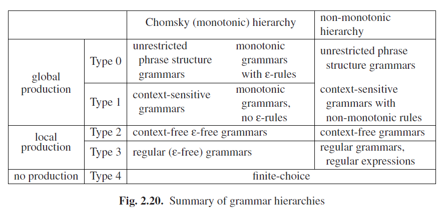

# 2.5 收缩或不收缩

在前面的段落中，关于是否一个规则的右侧要比其左侧简短，有时我们很明确但有时我们又是含糊不清的。0型规则应该说肯定是收缩的类型，而单调型规则肯定不是，2型和3型只有在生成空集（ε）时才是收缩的；这些都是肯定的。

原始Chomsky层次结构（Chomsky[385]）在这个问题上非常坚定：只有0型规则才能使句子形式收缩。1型、2型和3型规则都是单调的。此外1型规则必须使上下文相关类型，这意味着左侧非终结符的只有一个是被允许替换的（且不由ε替换）。这带来了一个合适的层次，使得每一层都是其父集的一个合适子集，以及使除了0型语法外的所有派生图实际上都是派生树。

作为一个例子，考虑一下图Fig 2.7中语言**anbncn**的语法：

它是单调的，但不是严格意义上的上下文相关。可以通过违反规则3和为**c**引入一个非终结符来使其成为CS：

现在图Fig 2.8的生成图变成了一个生成树：

还有另一个理由回避ε规则：它让定理和解析器都变得更复杂，有时尤其复杂；例如9.5.4节。因此就出现了一个问题，我们到底是为什么要纠结ε规则呢；答案很简单因为这对语法作者和使用者来说十分方便。

如果有一个语言是使用ε规则的CF语法来描述的，而我们想要使用一个不含ε规则的语法来进行描述时，那这个语法将会是非常复杂的。假设我们有一个系统，可以输入比特信息，比如“Amsterdam is the capital of the Netherlands”，“Truffles are expensive”，那就会被问道一个问题了。在一个非常浅显的水平上，我们可以将其输入定义为：

**inputs: zero-or-more-bits-of-info question**

或者，以一种扩展的记法

**inputs: bit-of-info* question**

因为**zero-or-more-bits-of-info**将会生成空字符串，在其他字符串之间，至少在其语法中使用的规则之一是ε规则；在扩展记法中的 * 已经意味着ε规则了。 在使用者的角度来看，上述输入的定义很好的解释了这个问题，并且就是我们想要的。

Any attempt to write an ε-free grammar for this input will end up defining a notion that comprises some of the later bits-of-info together with the question (since the question is the only non-empty part, it must occur in all rules involved!) But such a notion does not fit our problem at all and is an artifact:

As a grammar becomes more and more complicated, the requirement that it be ε-free becomes more and more of a nuisance: the grammar is working against us, not for us.

This presents no problem from a theoretical point of view: any CF language can be described by an ε-free CF grammar and ε-rules are never needed. Better still, any grammar with ε-rules can be mechanically transformed into an ε-free grammar for the same language.We saw an example of such a transformation above and details of the algorithm are given in Section 4.2.3.1. But the price we pay is that of any grammar transformation: it is no longer our grammar and it reflects the original structure less well.

The bottom line is that the practitioner finds the ε-rule to be a useful tool, and it would be interesting to see if there exists a hierarchy of non-monotonic grammars alongside the usual Chomsky hierarchy. To a large extend there is: Type 2 and Type 3 grammars need not be monotonic (since they can always be made so if the need arises); it turns out that context-sensitive grammars with shrinking rules are equivalent to unrestricted Type 0 grammars; and monotonic grammars with ε-rules are also equivalent to Type 0 grammars. We can now draw the two hierarchies in one picture; see Figure 2.20. Drawn lines separate grammar types with different power. Conceptually different grammar types with the same power are separated by blank space. We see that if we insist on non-monotonicity, the distinction between Type 0 and Type 1 disappears.

A special case arises if the language of a Type 1 to Type 3 grammar itself contains the empty string. This cannot be incorporated into the grammar in the monotonic hierarchy since the start symbol already has length 1 and no monotonic rule can make it shrink. So the empty string has to be attached as a special property to the grammar. No such problem occurs in the non-monotonic hierarchy.

Many parsing methods will in principle work for ε-free grammars only: if something does not produce anything, you can’t very well see if it’s there. Often the parsing method can be doctored to handle ε-rules, but that invariably increases the complexity of the method. It is probably fair to say that this book would be at least 30%

thinner if ε-rules did not exist — but then grammars would lose much more than 30% of their usefulness!