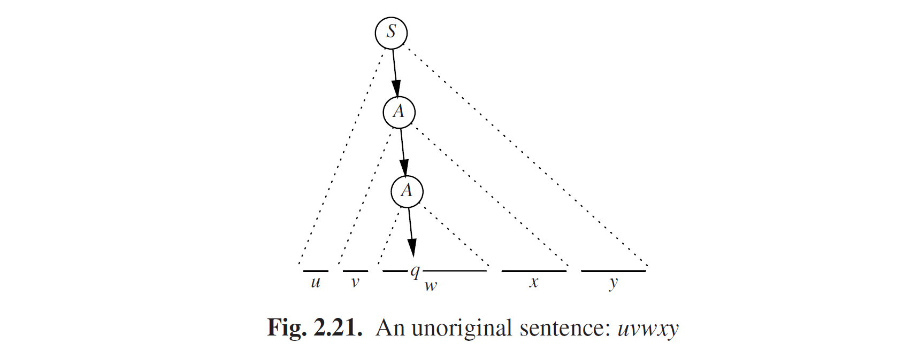
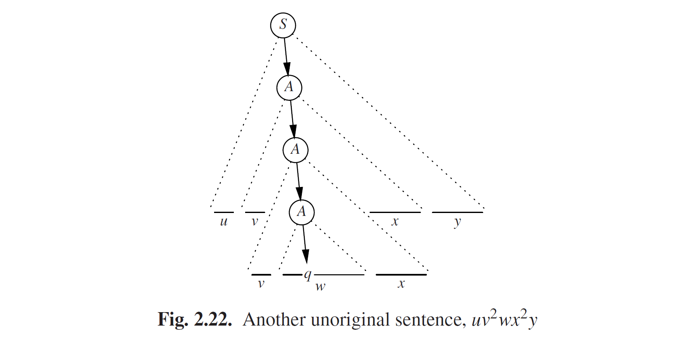

# 2.7.1 *uvwxy*理论

当我们从CF语法中获得了一个句子后，我们应该仔细看句中的每一个终结符，然后问自己：它是怎么在这的？然后看一下生成树，我们看到它被生成作为右侧规则m的第n位成员。这个规则的左侧，符号的父节点，再次生成规则Q的第p位成员，等等，直到我们到达起始符号。在某种意义上，我们可以通过这种方式追踪符号的轨迹。如果一个符号的轨迹的所有规则/成员对都是不同的，我们称这个符号是原始的，如果一个句子中的所有符号都是原始的，我们称这个句子是“原始”的。

例如，下面生成树中第一个**h**：

由下面语法生成的

**h**的谱系是，来自**7，1**，来自**4，1**，来自**3，3**，来自**1，1**.这里，第一个数字代表规则数，第二个数字代表这个规则中的成员数。因为所有的规则/成员对都是不相同的，所以**h**是原始的。

现在对于一个给定的符号，只有有限的方式来让其是原始的。这很容易，如下所示。一个原始符号的谱系中的所有规则/成员对必须是不相同的，所以其谱系的长度一定不会比语法中所有不同规则/成员对的总长度还长。 There are only so many of these, which yields only a finite number of combinations of rule/member pairs of this length or shorter. 理论中，一个符号的原始谱系的数量可能是非常巨大的，但实际中确实非常小的：如果有超过10种方法来生成一个给定的符号，从语法中通过原始谱系，那这个语法将会是非常错综复杂的！

这对原始句子就有了严格的限制。如果原始句子中一个符号出现两次，这两个的谱系必须不相同：如果谱系相同，那它们应该描述的是用一个位置的同一个符号。这意味着原始长度有着最大长度：所有符号的原始谱系的长度总和。对一个编程语言语法的平均的长度，在数以千计的符号的长度顺序中，大致相当于语法的长度。所以，因为有着最长的原始句子，那么就只能有着有限数量的原始句子，然后我们就得到了一个令人惊讶的结论就是任何CF语法只生成大小有限的原始句子核心，以及（也许）无限数量的非原始句子！

“非原始”句子是什么样的？这就是我们开始介绍*uvwxy*定理的地方。一个非原始句子具有这一的属性，在谱系中包含至少一个重复出现的符号。假设那个符号是*q*，重复的规则是*A*。那我们就可以画一幅累死图Fig2.21的图，*w*是由*A*的最新应用生成的部分，*vwx*是*A*的其他应用生成的部分，*uvwxy*就是这个非原始句子。现在我们立即就可以找到另一个非原始句子，通过删除以*A*为首的小三角，然后用以*A*为首的大三角副本替换；见图Fig 2.22。

这个新的树生成了句子*uvvwxxy*，并且以这种方式，可以很容易看到我们能构建句子*uvnwxny*的完整家族对于所有n ≥ 0的。这种方式显示了*w*嵌套于一组*v*和*x*括号之间，在*u*和*y*无关的上下文中。

底线是当我们审查一个上下文无关语言中的越来越长的句子，原始句子慢慢用尽，我们遇到的只是句子的相近形式的家族，慢慢缩进至无限。这在*uvwxy*理论中有总结：任何由CF语法生成的句子，比最长的原始句子还要长的句子，都可以被切分称五个部分*u,v,w,x,y*，以这种方式*uvnwxny*就是这个语法下n ≥ 0得来的一个句子。*uvwxy*理论也被称为上下文无关语言的泵引理（pumping lemma），而且由几个变种。

有两点必须在这里指出。第一点，如果一个语言持续生成越来越长的句子，而不减少嵌套句子的族系，那这个语言就不会存在一个CF语法。我们已经遇到了上下文相关语言**anbncn**，很容易看到（但不是很容易去证明！）它不会衰退成这样的嵌套的句子，当句子变得越来越长时。因此，它是没有CF语法的。这种证明的通用技术见Billington [396]。

The second is that the longest original sentence is a property of the grammar, not of the language. By making a more complicated grammar for a language we can increase the set of original sentences and push away the border beyond which we are forced to resort to nesting. If we make the grammar infinitely complicated, we can push the border to infinity and obtain a phrase structure language from it. How we can make a CF grammar infinitely complicated is described in the section on two-level grammars, 15.2.1.