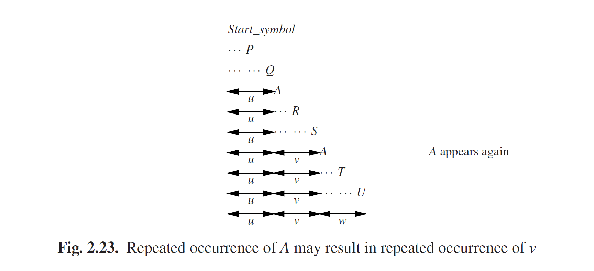

# 2.7.2 *uvw*理论

*uvw*理论的简单形式应用于正则（3型）语言。我们已经看到FS语法生成的句子形式全部都仅只包含一个非终结符，在结尾出现。在一个很长的句子的生成期间，一个或多个非终结符必须出现两次或多次，因为只能有有限数量的非终结符。图Fig2.23展示了当我们一个一个列出句子形式时所看到的。

子串*v*在*A*的一次出现到下一次之中被生成，*u*是让我们能到达*A*的一个序列，*w*是让我们能终止生成过程的序列。将明确指出，从第二个*A*开始，我们可能重复了跟第一个*A*一样的路径，从而生成了*uvvw*。这将我们引导到*uvw*理论，或*正则语言的泵引理（pumping lemma for regular languages）*：正则语言的任何一个足够长的字符串都能被切分成*u，v，w*3个部分，所以对n ≥ 0的所有*uvnw*都是这个语言的一个字符串。