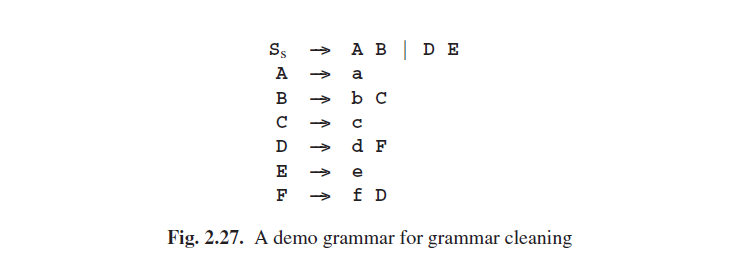

# 2.9.5 清理上下文无关语法

通常情况下，人们提供的语法不会包含未定义，不可到达或非生成性的非终结符。如果出现了，那几乎可以肯定是一个失误（或者是用来测试的！），然后我们就要检测和报告出来。然而，这种异常情况很容易出现在生成的语法或由其他语法转换所引入的语法中，这种情况下我们就希望能检测到然后“清理”一下语法。清理语法也是十分重要的，当我们获取解析森林语法的解析结果时（3.7.4节，13章以及其他很多地方）。

从一个上下文无关语法中检测和删除无用非终结符和规则的算法包含两个步骤：移除非生成性规则以及移除不可到达的非终结符。令人惊叹的由于未定义的非终结符，似的移除无用的规则并不是必须的：第一步为我们自动完成了这个过程。

我们将使用图Fig 2.27中的语法来进行演示。它看起来相当单纯：它的所有非终结符都是定义了的，而且它也没有表现出任何可疑的结构。

### 2.9.5.1 移除非生成性规则

我们通过找到一个生成性规则来寻找非生成性的规则。我们的算法取决于观测，如果一个规则的右侧包含的符号都是生成性的则这个规则就是生成性的。终结符是生成性的因为它能生成终结符，空也是生成性的因为它能生成空字符串。如果一个非终结符有一个生成性规则对应于它那它也是生成性的，但问题是起初我们并不知道哪条规则是生成性的，因为这本身就是我们在努力寻找的。

我们解决这个问题，首先通过使所有规则和非终结符都是“不知道”的。现在我们来看图Fig 2.27的语法，对于每一条我们不知道的规则，其右侧的成员都是生成性的，那我们就标记这条规则和它定义的非终结符为“生成性”的。这将为规则**A--->a, C--->c, 以及E--->e**产生标记，还有非终结符**A, C和E**。

现在我们知道的更多了，并且可以将这些用于对语法的第二轮扫描了。这使我们能标记规则**B--->bC**以及非终结符**B**，因为现在**C**已知是生成性的了。第三轮确定了**S--->AB**和**S**。第四轮没有产生新的东西，所以也就没有进行第五轮的必要了。

现在我们知道**S, A, B, C**和**E**是生成性的，但是**D、F**以及规则**S--->DE**还是标记“不知道”的。然而我们知道了更多的：知道我们尝试了生成性的所有可能路径，并且没有为**D、F**以及**S**的第二条规则找到任何可能的路径。这意味着我们现在可以更新一下对于“非生成性”的“不确定性”的信息了。**D、F**的规则以及**S**的第二条规则可以从语法中移除了；结果如果Fig 2.28所示。这就使得**D、F**成为了未定义的，而**S**仍然留在语法中因为它是生成性的，虽然有一个非生成性规则。

看看当语法中包含一个未定义的非终结符，例如*U*，将会发生什么，是一件有趣的事情。首先*U*将被预定义为“不知道”的，而因为没有规则定义它，它将一直保持“不知道”状态。因此，任何右侧有着*U*的规则*R*都将会是“不知道”的。最终两者都会被定义为“非生成性”的，然后所有的*R*规则都会被移除。可以看到“未定义的非终结符”只是“非生成性”的非终结符的一种特殊情况：因为它没有规则，所以他是非生成性的。

上述知识改进的算法使我们关于闭包算法的第一个例子。闭包算法有两个主要特点：初始化，是对最初了解的一个评估，部分源于其现状和“不知道的”部分；推导规则，介绍从几个地方获取的信息是如何结合的。对于我们的问题的推导规则是：

**对于每一个我们知道其右侧的所有成员都是生成性的规则，标记它定义的规则和非终结符为“生成性”的。**

It is implicit in a closure algorithm that the inference rule(s) are repeated until nothing changes any more. Then the preliminary “Don’t know” can be changed into a more definitive “Not X”, where “X” was the property the algorithm was designed to detect.

Since it is known beforehand that in the end all remaining “Don’t know” indications are going to be changed into “Not X”, many descriptions and implementations of closure algorithms skip the whole “Don’t know” stage and initialize everything to “Not X”. In an implementation this does not make much difference, since the meaning of the bits in computer memory is not in the computer but in the mind of the programmer, but especially in text-book descriptions this practice is unelegant and can be confusing, since it just is not true that initially all the non-terminals in our grammar are “Non-productive”.

We will see many examples of closure algorithms in this book; they are discussed in more detail in Section 3.9.

### 2.9.5.2 Removing Unreachable Non-Terminals

A non-terminal is called reachable or accessible if there exists at least one sentential form, derivable from the start symbol, in which it occurs. So a non-terminal A is reachable if S→* αAβ for some α and β.

We found the non-productive rules and non-terminals by finding the “productive” ones. Likewise, we find the unreachable non-terminals by finding the reachable ones. For this, we can use the following closure algorithm. First, the start symbol is marked “reachable”; this is the initialization. Then, for each rule in the grammar of the form A→α with A marked, all non-terminals in α are marked; this is the inference rule. We continue applying the inference rule until nothing changes any more. Now the unmarked non-terminals are not reachable and their rules can be removed.

The first round marks A and B; the second marks C, and the third produces no change. The result — a clean grammar — is in Figure 2.29. We see that rule E--->e, which was reachable and productive in Figure 2.27 became isolated by removing the non-productive rules, and is then removed by the second step of the cleaning algorithm.

Removing the unreachable rules cannot cause a non-terminal N used in a reachable rule to become undefined, since N can only become undefined by removing all its defining rules but since N is reachable, the above process will not remove any rule for it. A slight modification of the same argument shows that removing the unreachable rules cannot cause a non-terminal N used in a reachable rule to become non-productive: N, which was productive or it would not have survived the previous clean-up step, can only become non-productive by removing some of its defining rules but since N is reachable, the above process will not remove any rule for it. This shows conclusively that after removing non-productive non-terminals and then removing unreachable non-terminals we do not need to run the step for removing non-productive non-terminals again.

It is interesting to note, however, that first removing unreachable non-terminals and then removing non-productive rules may produce a grammar which again contains unreachable non-terminals. The grammar of Figure 2.27 is an example in point.

Furthermore it should be noted that cleaning a grammar may remove all rules, including those for the start symbol, in which case the grammar describes the empty language; see Section 2.6.

Removing the non-productive rules is a bottom-up process: only the bottom level, where the terminal symbols live, can know what is productive. Removing unreachable non-terminals is a top-down process: only the top level, where the start symbol(s) live(s), can know what is reachable.