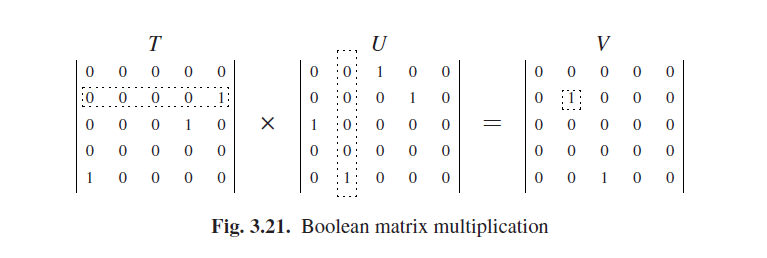

# 3.10 解析与布尔矩阵乘法的关系

在解析和布尔矩阵乘法之间有一个显著但又有点神秘的关系，因为很可能把一个转换为另一个，带有很多可能和但是。这有很有趣的含义。

一个布尔矩阵是一个其中所有元素只能为0或者1的矩阵。比如如果一个矩阵*T*的索引代表镇，那么元素*Ti,j*可能就表示城镇*i*到城镇*j*的直达铁路的距离。这样的矩阵可以和另外一个矩阵*Uj,k*相乘，这可以表示比如，一个城镇j到城镇k的直达巴士的距离。而*Vi,k*（*T*和*U*的乘积）的结果是一个布尔矩阵，这代表从城镇i到城镇k是否能联通，首先考虑火车然后才是巴士。这立刻就可以展示*Vi,k*是怎样计算出来的：必须有一个1，如果存在一个*j*使得*Ti,j*和*Uj,k*都能有保有一个1，否则就必须有一个0。公式如下：

*Vi,k* = (*Ti,1* ∧ *U1,k*)∨(*Ti,2* ∧ *U2,k*)∨· · ·∨(*Ti,n* ∧ *Un,k*)

其中∧是布尔运算的**和**，∨是布尔运算的**或**，n是矩阵的大小。这意味着*O(n)*的行为被*V*的每次输出所要求，其中就有n2；所以这个算法的时间复杂度为O(n3)。

图3.21给了一个示例；矩阵*T2, * *的行和矩阵*U * ,2*的列结合得到了矩阵*V2,2*的输出。布尔矩阵的乘法运算中，是不遵守交换律的：可以大致的理解为从一个镇到另一个镇有一个火车-巴士的路线，但是没有巴士-火车的路线，也就是*T*×*U*不等于*U*×*T*。注意这个跟传递闭包是不同的：在传递闭包中，一个单一关系遵循无限的次数，而在布尔矩阵运算中则是一个关系结果之后才有第二个。

上述是*布尔矩阵乘法（BMM）*的一个小实战，实际上BMM在许多数学和工科分支中是非常重要的，并且关于如何高效的使用它有一个完整的学科[^1]。数十年的集中努力带来了一系列越来越高效和负责的算法。V. Strassen[^2]是第一个打破*O(n3)*阻碍的算法，使用的是*O(n2.81···)*算法，到了现在这个记录是*O(n2.376···)*；时间是1987年。很明显，至少*O(n2)*次运行是必须的，但目前看来这个时间复杂度是达不到的。

More important from our viewpoint is the fact that in 1975 Valiant [18] showed how a CF parsing problem can be converted into a BMM problem. In particular, if you can multiply two Boolean matrices of size n×n in O(nk) actions, you can parse a string of length n in O(nk)+O(n2) actions, where the O(n2) is the cost of the conversion. So we can do general CF parsing in O(n2.376···), which is indeed better than the cubic time dependency of the CYK algorithm. But the actions of both Valiant’s algorithm and the fast BMM are extremely complicated and timeconsuming, so this approach would only be better for inputs of millions of symbols or more. On top of that it requires all these symbols to be in memory, as it is a nondirectional method, and the size of the data structures it uses is O(n2), which means that it can only be run profitably on a machine with terabytes of main memory. In short, its significance is theoretical only.

In 2002 Lee [39] showed how a BMM problem can be converted into a CF parsing problem. More in particular, if you can do general CF parsing of a string of length n in O(n3−δ) action , you can multiply two Boolean matrices of size n×n in O(n3−δ/3) actions. There is again a conversion cost of O(n2), but since δ can be at most 2 (in which unlikely case parsing could be done in O(n)), O(n3−δ/3) is at least O(n213 ), which dominates the O(n2); note that for δ = 0 the usual O(n3) bounds for both problems result. The computational efforts involved in Lee’s conversion are much smaller than those in Valiant’s technique, so a really fast general CF parsing algorithm would likely supply a fast practical BMM algorithm. Such a fast general CF parsing algorithm would have to be non-BMM-dependent and have a time complexity better than O(n3); unfortunately no such algorithm is known.

General CF parsing and Boolean matrix multiplication have in common that the efficiencies of the best algorithms for them are unknown. Figure 3.22 summarizes the possibilities. The horizontal axis plots the efficiency of the best possible general CF parsing algorithm; the vertical axis plots the efficiency of the best possible BMM algorithm. A position in the graph represents a combination of these values. Since these values are unknown, we do not know which point in the graph corresponds to reality, but we can exclude several areas.

The grey areas are excluded on the grounds of existing algorithms. For example, the grey area on the right of the vertical line at n3 is excluded because we have the CYK algorithm, which does general CF parsing in O(n3); so the pair (best parser, best BMM) cannot have a first component which is larger than O(n3). Likewise the area left of the vertical line at n1 represents parsing algorithms that work in less than O(n), which is impossible since the parser must touch each token. BMM requires at least O(n2) actions, but an algorithm for O(n2.376···) is available; this yields two horizontal forbidden areas.

The shading marks the areas that are excluded by the Valiant and Lee conversion algorithms. Valiant’s result excludes the horizontally shaded area on the right; Lee’s result excludes the vertically shaded area at the top. The combination of the efficiencies of the true best parsing and BMM algorithms can only be situated in the white unshaded area in the middle.

Extensive research on the BMM problem has not yielded a usable algorithm that is substantially better than O(n3); since BMM can be converted to parsing this could explain why the admittedly less extensive research on general CF parsing has not yielded a better than O(n3) algorithm, except through BMM. On the other hand Figure 3.22 shows that it is still possible for general CF parsing to be linear (O(n1)) and BMM to be worse than O(n2).

Rytter [34] has linked general CF parsing to a specific form of shortest-path computation in a lattice, with comparable implications.

Greibach [389] describes the “hardest context-free language”, a language such that if we can parse it in time O(nx), we can parse any CF language in time O(nx). Needless to say, it’s hard to parse. The paper implicitly uses a parsing technique which has received little attention; see Problem 3.7.

[^1]: For a survey see V. Strassen, “Algebraic complexity theory”, in Handbook of Theoretical Computer Science, vol. A, Jan van Leeuwen, Ed. Elsevier Science Publishers, Amsterdam, The Netherlands, pp. 633-672, 1990.

[^2]: V. Strassen, “Gaussian elimination is not optimal”, Numerische Mathematik, 13:354-356, 1969.
