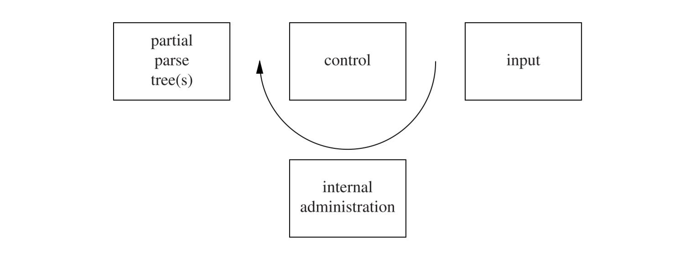

# 3.3 非确定型自动机

上述两个例子都表征了两个组成部分：一个可以进行替换和记录解析树的机器，以及一个决定机器该做那些动作的控制机器。这个机器相对简单，因为其替换仅允许语法所允许的那些，但是控制机制可以是任意复杂的，并且可能包含语法的广泛的知识。

这种结构可以在所有解析方法中看出：总是有一个替换和保持记录的机器，以及一个指导性的控制机器：

替换的机器被称为*非确定型自动机*或NDA；被称为“非确定型”是因为经常有几个可能的行动，并且特殊选择没有预先决定，而“自动”是因为会自动执行应激的操作。它管理三个组件： It manages three components: the input string (actually a copy of it), the partial parse tree and some internal administration. Every move of the NDA transfers some information from the input string through the administration to the partial parse tree. Each of the three components may be modified in the process:

The great strength of an NDA, and the main source of its usefulness, is that it can easily be constructed so that it can only make “correct” moves, that is, moves that keep the system of partially processed input, internal administration and partial parse tree consistent. This has the consequence that we may move the NDA any way we choose: it may move in circles, it may even get stuck, but if it ever gives us an answer, in the form of a finished parse tree, that answer will be correct. It is also essential that the NDA can make all correct moves, so that it can produce all parsings if the control mechanism is clever enough to guide the NDA there. This property of the NDA is also easily arranged.

The inherent correctness of the NDA allows great freedom to the control mechanism, the “control” for short. It may be naive or sophisticated, it may be cumbersome or it may be efficient, it may even be wrong, but it can never cause the NDA to produce an incorrect parsing; and that is a comforting thought. If it is wrong it may, however, cause the NDA to miss a correct parsing, to loop infinitely, or to get stuck in a place where it should not.