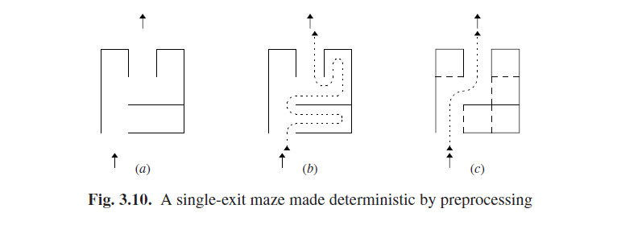

# 3.5.4 线性化方法

上一节所示的大多数一般搜索方法，最坏的情况都依赖于时间指数分布：输入的每个附加符号都将解析时间乘以一个常数因子。这些方法只在输入长度非常小的情况下适用，大约20个字符就是最大值了。即便是上述方法中最优的，在最坏的情况下也要求立方次时间：10个令牌时需要1000次操作，100个令牌时需要1000000次操作，而10000个令牌（一个较大的计算机程序文件）时则需要1012次操作，即便每次操作只需10纳秒也要花费至少3小时的时间。显然在真实的速度下，我们更希望有一个线性时间的计算方法。不幸的是，至今没有找到这样一种方法，尽管没有证据表明这种方法是不存在的，但种种迹象却表明似乎情况就是如此了；详情见3.10节。将此与非严格短语结构解析方法相比，就可以证明没有这种算法存在了（见3.4.2节）。

因此，同时或者永久的，我们将不得不从我们的目标中拿掉一个对象，线性时间通用解析器。我们可以有一个最优也是立方次时间依赖的通用解析器，或者是一个不能适用于所有CF语法的线性解析器，但这两者不能兼有。幸运的是，有延时解析方法（特别是LR解析），可以处理大量语法种类，但依旧如果一个语法只是用最自然的方式来描述一个预期的语言而没有涉及到分析方法，那就只有很小的机会能使用自动线性分析。在实践中，语法通常首先是为了自然而设计，然后通过手动调整来符合现有分析方式的要求。这种调整相对简单，具体取决于所选择的方法。简而言之，对于任意给定语法做一个线性解析器有10%的工作是艰难的，而另外90%可以由计算机来完成。

我们可以通过限制非确定性解析自动机的处理位移数量在每种情况下只有一个来实现线性解析时间。由于这种情况下一个自动机的处理位移没有别的选择，所以被称为“确定性自动机”。

确定性自动机的处理位移是由输入流明确确定的（现在我们可以说是流，因为自动机是从左到右处理的）。这个的序列就是一个自动机能给出的一个句子的唯一一个解析。如果语法是明确的那这就是正确的，单如果语法不明确，那确定性自动机将会把我们定死在一个特定的解析中。我们将在8.2.5.3节和9.9节中细说。

剩下的就是解释如何从语法中推导出解析自动机的确定性控制机制。由于对这个问题没有一个单独的很好的解决办法，那么存在很多的次优的解决方案就不足为奇了。从一个非常广泛的角度来说，它们都使用同样的技术：它们都深入分析语法，以使可用于识别死角的信息被发现。然后就可以避开这些死角。如果应用于该语法的方法，能够避开足够多的死角并使得不在存在死角，那么这个方法对于语法来说就是成功的，并且给我们提供了一个线性时间解析器。或者它失败了，那我们要么换另一个方法要么就改变语法使之能够使用该方法。

A (limited) analogy with the maze problem can perhaps make this clearer. If we are allowed to do preprocessing on the maze (unlikely but instructive) the following method will often make our search through it deterministic. We assume that the maze consists of a grid of square rooms, as shown in Figure 3.10(a). Depth-first search would find a passage through the maze in 13 moves (Figure 3.10(b)). Now we preprocess the maze as follows: if there is a room with three walls, add the fourth wall, and continue with this process until no rooms with three walls are left. If all rooms now have either two or four walls, there are no choices left and our method has succeeded; see Figure 3.10(c), where the passage now takes 5 moves, with no searching involved. We see how this method brings information about dead ends to the surface, to help restrict the choice.

It should be pointed out that the above analogy is a limited one. It is concerned with only one object, the maze, which is preprocessed. In parsing we are concerned with two objects, the grammar, which is static and can be preprocessed, and the input, which varies. (But see Problem 3.6 for a way to extend the analogy.)

Returning to the parsing automaton, we can state the fact that it is deterministic more precisely: a parsing automaton is deterministic with look-ahead k if its control mechanism can, given the internal administration and the next k symbols of the input, decide unambiguously what to do next — to either match or predict and what to predict in the top-down case, and to either shift or reduce and how to reduce in the bottom-up case.

It stands to reason that a deterministic automaton creates a linear-time parser, but this is not completely obvious. The parser may know in finite time what to do in each step, but many steps may have to be executed for a given input token. More specifically, some deterministic techniques can require k steps for a given position k, which suggests that quadratic behavior is possible (see Problem 3.5). But each parsing step either creates a node (predict and reduce) or consumes an input token (match and shift). Both actions can only be performed O(n) times where n is the length of the input: the first because the size of the parse tree is only O(n) and the second because there are only n input tokens. So however the actions of the various tasks are distributed, their total cannot exceed O(n).

Like grammar types, deterministic parsing methods are indicated by initials, like LL, LALR, etc. If a method X uses a look-ahead of k symbols it is called X(k). All deterministic methods require some form of grammar preprocessing to derive the parsing automaton, plus a parsing  lgorithm or driver to process the input using that automaton.