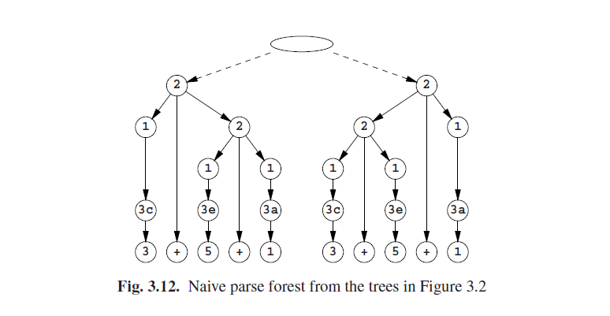
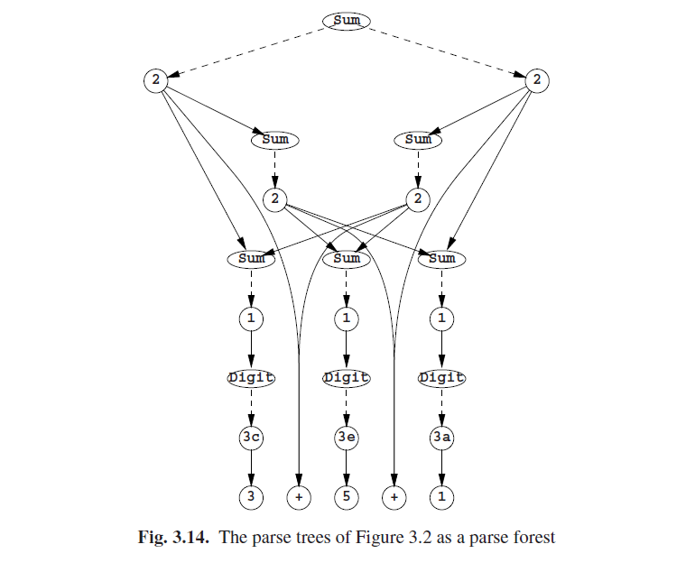

# 3.7.3 解析林

由于森林只是树的集合，所以解析林最天然的形式是由一个单一的节点组成，而解析林中的所有树都可以直接访问。图3.2中的两个解析树合并到图3.12中的解析林中，其中节点中的数字引用了图3.1的语法中的规则号。

当我们看到这幅图时，我们会注意到两件事情：虚线箭头与实线箭头的含义不同；结果树包含大量重复的子树。而且还会好奇顶部的空节点应该是什么。

虚线箭头的含义是“或-或”：顶部的空节点指向左边*或*是右边的标记2的节点，那么实线箭头就是“与-与”：左边标记2的节点由一个标记Sum的节点*与*一个标记+的节点*与*一个标记Sum的节点组成。更特别的是，顶部的空节点，应该被标记为Sum指向规则2的两个应用程序，其中每一个都生成**Sum + Sum**；最左侧的**Sum**指向一个规则1应用程序，第二个**Sum**指向一个规则2应用程序，等等。图3.13展示了完整的*与-或树*，这里我们看到了一个标记非终结符的节点的替换，即*或节点*，以及标记了规则号的节点，即*与节点*。A非终结符的一个或节点对A的终结符的子节点有一个规则号；一个规则号的与节点有右侧规则的子节点的组件。

### 3.7.3.1 Combining Duplicate Subtrees

We are now in a position to combine all the duplicate subtrees in the forest. We do this by having only one copy of a node labeled with a non-terminal A and spanning a given substring of the input. If A produces that substring in more than one way, more than one or-arrow will emanate from the OR-node labeled A, each pointing to an AND-node labeled with a rule number. In this way the AND-OR tree turns into a directed acyclic graph, a dag, which by rights should be called a parse dag, although the term “parse forest” is much more usual. The result of our example is shown in Figure 3.14.

It is important to note that two OR-nodes (which represent right-hand sides of rules) can only be combined if all members of the one node are the same as the corresponding members of the other node. It would not do to combine the two nodes marked 2 in Figure 3.14 right under the top; although they both read Sum+Sum, the Sums and even the +s are not the same. If they were combined, the parse forest would represent more parse trees than correspond with the input; see Problem 3.8.

It is possible to do the combining of duplicate subtrees during parsing rather than afterwards, when all trees have been generated. This is of course more efficient, and has the additional advantage that it allows infinitely ambiguous parsings to be represented in a finite data structure. The resulting parse forest then contains loops (cycles), and is actually a parse graph.

Figure 3.15 summarizes the situation for the various Chomsky grammar types in relation to ambiguity. Note that finite-state and context-sensitive grammars cannot be infinitely ambiguous because they cannot contain nullable rules. See Figure 2.16 for a similar summary of production data structures.

### 3.7.3.2 Retrieving Parse Trees from a Parse Forest

The receiver of a parse forest has several options. For example, a sequence of parse trees can be generated from it, or, perhaps more likely, the data structure can be pruned to eliminate parse trees on various grounds.

Generating parse trees from the parse forest is basically simple: each combination of choices for the or-or arrows is a parse tree. The implementation could be top-down and will be sketched here briefly. We do a depth-first visit of the graph, and for each OR-node we turn one of the outgoing dashed arrows into a solid arrow; we record each of these choices in a backtrack chain. When we have finished our depth-first visit we have fixed one parse tree. When we are done with this tree, we examine the most recent choice point, as provided by the last element of the backtrack chain, and make a different choice there, if available; otherwise we backtrack one step more, etc. When we have exhausted the entire backtrack chain we know we have generated all parse trees. One actualization of a parse tree is shown in Figure 3.16.

It is usually more profitable to first prune the parse forest. How this is done depends on the pruning criteria, but the general technique is as follows. Information is attached to each node in the parse forest, in a way similar to that in attribute grammars (see Section 2.11.1). Whenever the information in a node is contradictory to the criteria for that type of node, the node is removed from the parse forest. This will often make other nodes inaccessible from the top, and these can then be removed as well.

Useful pruning of the parse forest of Figure 3.14 could be based on the fact that the + operator is left-associative, which means that a+b+c should be parsed as ((a+b)+c) rather than as (a+(b+c)). The criterion would then be that for each node that has a + operator, its right operand cannot be a non-terminal that has a node with a + operator. We see that the top-left node marked 2 in Figure 3.14 violates this criterion: it has a + operator (in position 2) and a right operand which is a nonterminal (Sum) which has a node which has a node (2) which has a + operator (in position 4). So this node can be removed, and so can two further nodes. Again the parse tree from Figure 3.16 remains.

The above criterion is a (very) special case of an operator-precedence criterion for arithmetic expressions; see Problem 3.10 for a more general one.