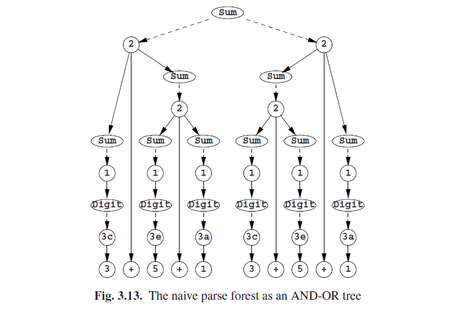
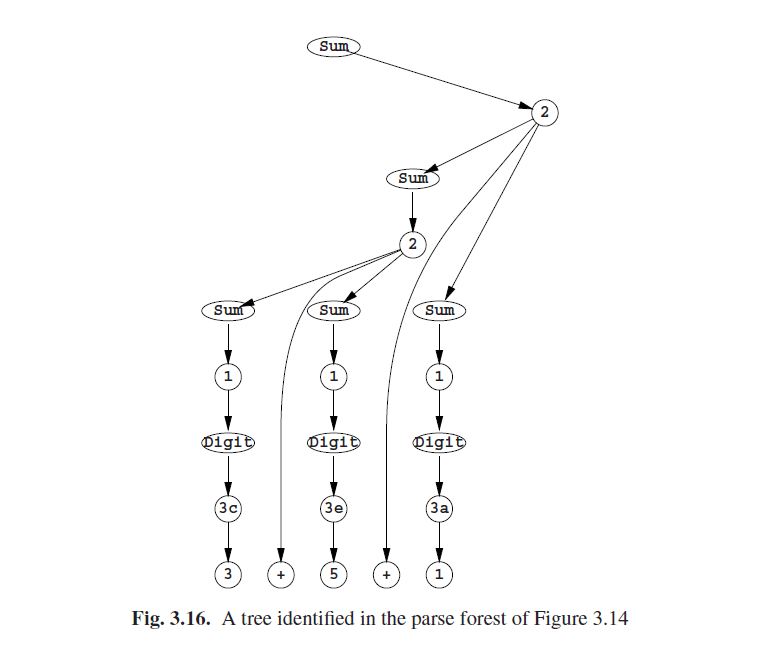

# 3.7.3 解析林

由于森林只是树的集合，所以解析林最天然的形式是由一个单一的节点组成，而解析林中的所有树都可以直接访问。图3.2中的两个解析树合并到图3.12中的解析林中，其中节点中的数字引用了图3.1的语法中的规则号。

当我们看到这幅图时，我们会注意到两件事情：虚线箭头与实线箭头的含义不同；结果树包含大量重复的子树。而且还会好奇顶部的空节点应该是什么。

虚线箭头的含义是“或-或”：顶部的空节点指向左边*或*是右边的标记2的节点，那么实线箭头就是“与-与”：左边标记2的节点由一个标记Sum的节点*与*一个标记+的节点*与*一个标记Sum的节点组成。更特别的是，顶部的空节点，应该被标记为Sum指向规则2的两个应用程序，其中每一个都生成**Sum + Sum**；最左侧的**Sum**指向一个规则1应用程序，第二个**Sum**指向一个规则2应用程序，等等。图3.13展示了完整的*与-或树*，这里我们看到了一个标记非终结符的节点的替换，即*或节点*，以及标记了规则号的节点，即*与节点*。A非终结符的一个或节点对A的终结符的子节点有一个规则号；一个规则号的与节点有右侧规则的子节点的组件。

### 3.7.3.1 合并重复子树

现在我们可以将解析林中的重复子树合并在一起了。我们通过保留标记了非终结符A以及跨越输入的给定子字符串的一个副本来做到。如果*A*以多种方式来生成子字符串，那么多个或箭头将从标记了A的或节点出发，每一个都指向一个标记了规则号的与节点。这样，与-或树就变成了一个有向无环图，一个有向无环图，其实正确的叫法应该是一个*解析有向无环图*，也就是“解析林”变得更加通常了。我们示例的结果如图3.14 所示。

必须注意的是，两个或节点（这代表着规则的右侧）只能在两个节点的其他所有对应节点都相同时才能合并。它不会将图3.14中顶部正下方的两个标记为2两个节点合并；即便它们都是**Sum+Sum**，因为其中**Sum**和**+**都是不一样的。如果将它们合并在一起，那解析林会展示出比对应输入更多的解析树；参见问题3.8.

合并重复子树的过程可以在解析过程中，而不是所有解析树都完成之后。这明显是更高效的，并且有额外的优势，它允许在无限模糊的解析展现在有限的数据结构中。然后解析林就包含循环（环），实际上就是*解析图*。

图3.15总结了各种Chomsky语法类型相对于歧义的情况。请注意，有限状态和上下午相关语法不能无限模糊，因为它们不能包含可以为空（nullable）的规则。有关生产数据结构的类似摘要，请参见图2.16。

### 3.7.3.2 从解析林中检索解析树

解析林的接收器有多个选择。例如，可以从它生成一个解析树序列, 或者更可能的是, 数据结构可以被修改以剔除各种原因产生的解析树。

Generating parse trees from the parse forest is basically simple: each combination of choices for the or-or arrows is a parse tree. The implementation could be top-down and will be sketched here briefly. We do a depth-first visit of the graph, and for each OR-node we turn one of the outgoing dashed arrows into a solid arrow; we record each of these choices in a backtrack chain. When we have finished our depth-first visit we have fixed one parse tree. When we are done with this tree, we examine the most recent choice point, as provided by the last element of the backtrack chain, and make a different choice there, if available; otherwise we backtrack one step more, etc. When we have exhausted the entire backtrack chain we know we have generated all parse trees. One actualization of a parse tree is shown in Figure 3.16.

It is usually more profitable to first prune the parse forest. How this is done depends on the pruning criteria, but the general technique is as follows. Information is attached to each node in the parse forest, in a way similar to that in attribute grammars (see Section 2.11.1). Whenever the information in a node is contradictory to the criteria for that type of node, the node is removed from the parse forest. This will often make other nodes inaccessible from the top, and these can then be removed as well.

Useful pruning of the parse forest of Figure 3.14 could be based on the fact that the + operator is left-associative, which means that a+b+c should be parsed as ((a+b)+c) rather than as (a+(b+c)). The criterion would then be that for each node that has a + operator, its right operand cannot be a non-terminal that has a node with a + operator. We see that the top-left node marked 2 in Figure 3.14 violates this criterion: it has a + operator (in position 2) and a right operand which is a nonterminal (Sum) which has a node which has a node (2) which has a + operator (in position 4). So this node can be removed, and so can two further nodes. Again the parse tree from Figure 3.16 remains.

The above criterion is a (very) special case of an operator-precedence criterion for arithmetic expressions; see Problem 3.10 for a more general one.