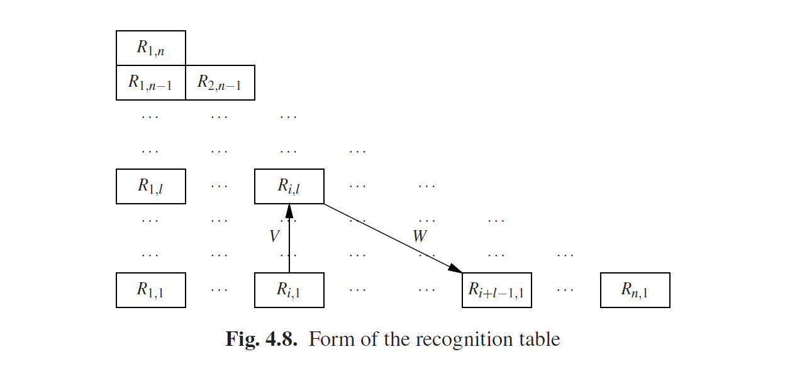
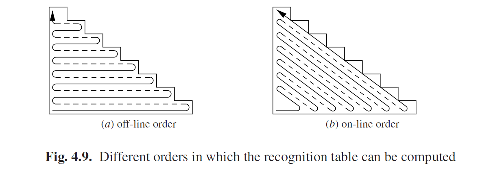

### 4.2.2 Chomsky基本形式语法的CYK识别

我们想对语法施加的两个限制现在已经很明显了：不要单元规则，也不要ε规则。我们还希望将右侧的最大长度限制为2；这将降低时间复杂度到*O(n3)*。这样又回到了有一个完全适合这两个限制的CF语法：Chomsky基本形式。就好像这种基本形式就是为这种算法设计的。*Chomsky基本形式（CNF）*的语法，当所有规则都是形式*A → a*或*A → BC*，其中*a*是终结符而*A，B，C*是非终结符。幸运的是我们稍后将看到，任何CF语法都将可以机械性的转换为CNF语法。

我们将首先讨论CYK算法如何在CNF中处理语法。在CNF语法中是没有ε规则的，因此*Rε*为空。集合R*i*,1可以直接从规则中读取：它们由形式为*A→a*的规则所决定。规则*A→BC*永远不能推导出一个单独的终结符，因为没有ε规则。

接下来，我们像以前一样进行迭代，首先处理长度为2的子字符串，然后是长度为3的，等等。当一个右侧*BC*要推导出一个长度为*l*的子字符串是，*B*必须推导出第一部分（非空），而*C*负责后面的部分（也非空）。

因此*B*必须推导出*si,k*，也就是说，*B*必须是属于*Ri,k*的，同样的*C*必须推导出*si+k,l−k*；也就是说，*C*必须是属于*Ri+k,l−k*。要确定这样的k是否存着很容易：只要试一下所有的可能性；它们的范围从1到l-1。所有集合*Ri,k*和*Ri+k,l−k*这时候已经计算出来了。

这个过程比我们之前看到的复杂度要低的多，它适用于一般的CF语法，原因有二。最重要的一点是，我们不需要一遍又一遍的重复直到没有新的非终结符被添加到*Ri,l*中。在这里我们处理的子字符串是真正的子字符串：它不能与我们开始的字符串相等。第二个原因是，我们只需要找到一个将字符串分为两部分的位置，因为右侧仅包含两个非终结符。在模糊语法中，可能会有几种不同的拆分方法，不过我们并不需要去担心这个。模糊是一个解析问题，而不是识别问题。

该算法生成了一个完整的集合*Ri,l*。句子*t*由*n*个符号组成，因此从位置*i*开始的子字符串绝不可能有超过*n+1-i*个符号。这意味着不存在这样的子字符串*si,l*，其中*i+l > n+1*。因此集合*Ri,l*可以放在一个三角形形式的表中，如图Fig4.8所示。这个表称为识别表(*recognition table*)，或者是正确格式的子字符串表(*well-formed substring table*)。

条目*Ri,l*是根据箭头*V*和*W*同时计算的，如下所示。我们考虑的第一个条目是箭头V开头的*Ri,1*。*Ri,1*的所有非终结符*B*都生成从位置*i*开始长度为1的子字符串。由于我们在试图获得从位置*i*开始的长度*l*的子字符串的解析，那我们对从位置*i*+1开始的长度为*l*-1的子字符串感兴趣。这应该在*Ri+1,l−1*中寻找，在箭头*W*的开头处。现在我们将从*Ri,1*中找出的所有*B*和从*Ri+1,l−1*中找出的*C*结成对，并且对于每一对在语法中都有一个规则*A→BC*的*B*和*C*，我们在*Ri,l*中插入一个*A*。同样的，*Ri,2*中的一个*B*可以和*Ri+2,l−2*中的一个*C*结合成一个*A*，等等；我们一直这样做直到箭头*V*结尾处的*Ri,l−1*和*W*结尾处的*Ri+l−1,1*。

条目*Ri,l*不能被计算，直到在顶部的三角的所有输入都已经清晰之后。这将在一定程度上限制可以被计算的条目的顺序。图Fig4.9（*a*）描述了一种计算识别表的方法；它遵循我们前面的描述，在长度为*l*-1的子字符串被全部识别完之前不会识别长度为*l*的子字符串。我们也可以按照图Fig4.9（*b*）的描述来计算识别表。按这种顺序，一旦计算所需的集合和输入符号都可用了，就可以立马计算*Ri,l*了。这个顺序特别适合于在线解析，当输入的符号数量事先并不知道时，并且每次读取新的符号都会计算其他信息。

现在我们来看一下此算法的成本。图Fig4.8显示有*n*(*n*+1)/2个条目需要填充。填写条目需要检查箭头V上的所有条目，其中最多有n个条目；一般来说会更少，并且实际上很多条目是空的并不需要检查。我们把将会真正被计算的条目的“发生次数”写作*nocc*；通常这个值会远小于n，并且对于许多语法来说这是个常量，但是对于最不理想的情况，这个值应该考虑就是*n*。一旦箭头*v*上的条目被选中，箭头*W*上相应的条目就将固定下来，因此查找的消耗不取决于*n*。因此，该算法具有*O(n2nocc)*的时间要求，并且在最不理想的情况下，与输入句子长度的立方成正比，与本小结开头所提到的一样。

算法的成本还取决于语法的特性。沿着箭头*V*和*W*的条目每个最多能包含|*VN*|个非终结符，其中|*VN*|是语法中非终结符的个数，从2.2节中语法的定义中设置的*VN*的大小。但是实际数量通常要低得多，因为通常只有非常有限的非终结符的子集才能在给定位置产生给定长度的输入段；我们用|*VN*|occ来代表数量。因此一个组合步骤的成本是*O*(&&|VN|_{occ}^{2}&&)。在语法中找到将*B*和*C*组合成*A*的规则，可以在一个恒定的时间内完成，通过哈希或者预计算，并且不会增加这个组合步骤的成本。这给出了*O*($$|VN|_{occ}^{2}$$ n2 nocc)的总时间。

文献中关于识别表的第二个索引应该代表识别段的长度还是结束位置存在一些分歧。但很显然，两者最终传达的意义一致，但在不同的时候使用两个意义会带来不同的便利性。有些事例可以说明，在Earley解析（7.2节）以及作为交点解析（13章）中，使用结束位置的意义比较好，但是在CYK解析中，无论是概念还是绘图上，使用长度意义都会更好。