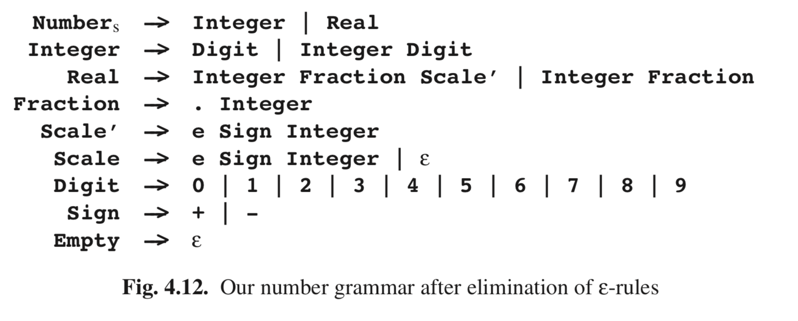
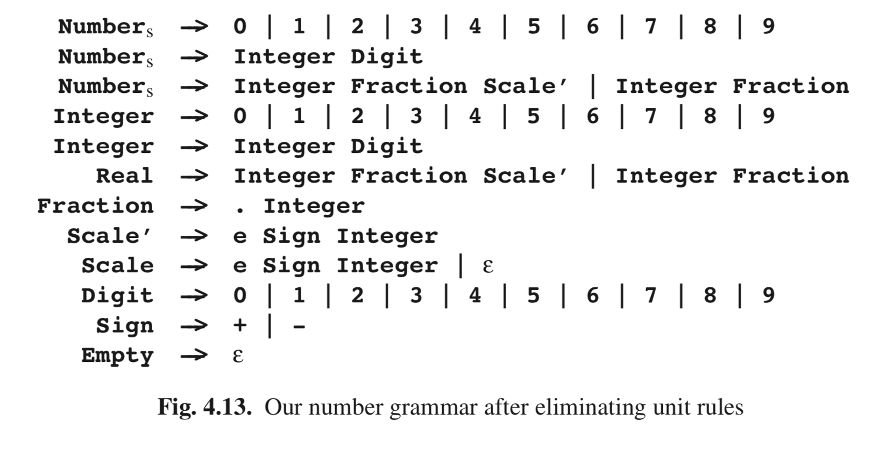
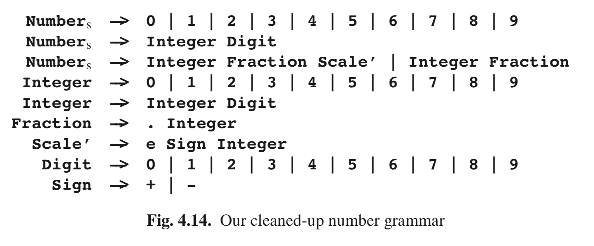

# 4.2.3 将CF语法转换为Chomsky普通形式

上一节中已经表明，将一个CF语法转换为CNF语法是值得的。本节我们将使用数字语法来讲讲这个转换过程。这个过程可以分为几个阶段：

- 首先，去除ε规则被；

- 第二，去除单元规则；

- 第三，如2.9.5节所述，对语法进行整理；

- 第四也就是最后，修改剩余的语法规则，并添加规则，直到它们都是我们所需的形式，即*A → a*或者*A → BC*。

所有的这些更改都不会改变原本语法所定义的语言的最终形式。现在你还体会不到这一点。关于形式语言理论的大多数书籍会更正式的讨论和介绍这一点，各位可以去自行了解；例如Hopcroft和Ullman [391]。

### 4.2.3.1 去除ε规则

假设我们有一个语法*G*，有一个ε规则*A → ε*，然后现在我们想要去掉这个规则。我们当然不能直接删掉规则，这样会改变非终结符*A*定于的语言，以及语法*G*所定义的语言也很可能被改变。因此对于语法右侧出现的非终结符*A*，必须采取一些措施。当语法规则*B* → α*A*β中出现*A*的时候，我们用两个其他的规则来代替：*B* → α*A‘*β，其中*A’*是一个全新的非终结符，然后我们稍后会为它增加新的规则（这些规则将是*A*的非空语法规则）；以及*B* → αβ，这个来处理在规则*B* → α*A*β中*A*生成ε的部分。需要注意的是，上述规则中的α和β也有可能包含*A*；这样的情况下，必须用同样的方式替换每一个相关规则，直到所有与*A*相关的都没有了。当我们做完之后，语法中不会在有*A*出现。

每一个ε规则都必须用这种方法处理。当然，在这个过程中可能会产生新的ε规则。这只是一个预计：这个过程使所有ε生成变成显示。新产生的ε规则必须用一模一样的方式处理。直到最后这个过程会结束，因为生成ε规则的非终结符是有限的，并且，最终在右侧不会在出现这样的非终结符。

去除ε规则的下一步是为新的非终结符添加语法规则。如果*A*是引入*A‘*的非终结符，我们就为所有的非ε规则*A‘ → α*添加一个*A → α*规则。由于所有ε规则都已经明确了，我们就可以确定，如果一个规则并不直接产出ε，那么它也将不能间接产生。这里可能会出现的一个问题是，*A*可能没有一个非ε规则。在这种情况下，*A*将只能产生ε，所以我们可以去掉所有使用*A‘*的规则。

这些依然留给我们一个含有ε规则的语法。但是，任何含有ε规则的非终结符都不可以从起始字符到达，但有一个重要的例外：起始字符本身除外。特别是，现在我们就有一个规则*S → ε*，当且只当ε是语法*G*所定义的语言的一个成员时。此时所有其他含有ε规则的非终结符可以安全的去除，但对语法的实际清理将会留到稍后。

图Fig4.10的语法是一个让人讨厌的语法，用来检测ε规则去除方案。这个方案将语法转换为图Fig4.11的语法。

这个语法依旧含有ε规则，但是可以通过去掉非生成性的以及/或者不可到达的非终结符来消除掉。将此语法清理到只有一个规则留下：*S → a*。去掉我们的数字语法中的ε规则，最后会得到图Fig4.12中的语法。注意，生成**ε**，**空集**和**缩放集**，的两个规则仍在，只是不在使用了。

### 4.2.3.2 去除单元规则

The next trouble-makers to be eliminated are the unit rules, that is, rules of the form A → B. It is important to realize that, if such a rule A → B is used in a derivation, it must be followed at some point by the use of a rule B → α. Therefore, if we have a rule A → B, and the rules for B are

B → α1 | α2 | ··· | αn,

we can replace the rule A → B with

A → α1 | α2 | ··· | αn.

In doing this, we can of course introduce new unit rules. In particular, when repeating this process, we could at some point again get the rule A → B. In this case, we have an infinitely ambiguous grammar, because this means that B derives B. Now this may seem to pose a problem, but we can just leave such a unit rule out; the effect is that we short-cut derivations like

A → B → ··· → B → ···

Also rules of the form A → A are left out. In fact, a pleasant side effect of removing ε-rules and unit rules is that the resulting grammar is not infinitely ambiguous any more.

Removing the unit rules in our ε-free number grammar results in the grammar of Figure 4.13.

### 4.2.3.3 Cleaning up the Grammar

Although our number grammar does not contain non-productive non-terminals, it does contain unreachable ones, produced by eliminating the ε-rules: Real, Scale, and Empty. The CYK algorithm will work equally well with or without them, so cleaning up the grammar, as described in Section 2.9.5, is optional. For conceptual and descriptional simplicity we will clean up our grammar here, but further on (Sec- tion 4.2.6) we shall see that this is not always advantageous. The cleaned-up grammar is shown in Figure 4.14.

### 4.2.3.4 Finally, to the Chomsky Normal Form

After all these grammar transformations, we have a grammar without ε-rules or unit rules, all non-terminal are reachable, and there are no non-productive non-terminals. So we are left with two types of rules: rules of the form A → a, which are already in the proper form, and rules of the form A → X1X2 ···Xm, with m ≥ 2. For every terminal b occurring in such a rule we create a new non-terminal Tb with only the rule Tb → b, and we replace each occurrence of b in a rule A → X1X2 ···Xm with Tb. Now the only rules not yet in CNF are of the form A → X1X2 ···Xm, with m ≥ 3, and all Xi non-terminals. These rules can now just be split up:

A → X1X2···Xm

is replaced by the following two rules:

A → A1X3···Xm

A1 → X1X2

where A1 is a new non-terminal. Now we have replaced the original rule with one that is one shorter, and one that is in CNF. This splitting can be repeated until all parts are in CNF. Figure 4.15 represents our number grammar in CNF.