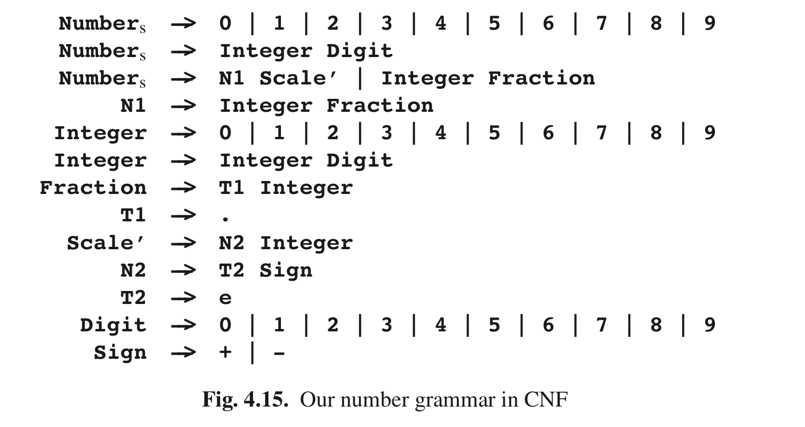

# 4.2.4 The Example Revisited

Now let us see how the CYK algorithm works with our example grammar, which we have just transformed into CNF. Again, our input sentence is 32.5e+1. The recognition table is given in Figure 4.16. The bottom row is read directly from the grammar. For example, the only non-terminals having a production rule with right- hand side 3 are Number, Integer, and Digit. Notice that for each symbol a in the sentence there must be at least one non-terminal A with a production rule A → a, or else the sentence cannot be derived from the grammar.

The other rows are computed as described before. Actually, there are two ways to compute a certain Ri,l. The first method is to check each right-hand side in the grammar. For example, to check whether the right-hand side N1 Scale’ derives the substring 2.5e (= s2,4 ). The recognition table derived so far tells us that

- N1 is not a member of R2,1 or R2,2,

- N1 is a member of R2,3 , but Scale’ is not a member of R5,1

so the answer is no. Using this method, we have to check each right-hand side in this way, adding the left-hand side to R2,4 if we find that the right-hand side derives s2,4.

The second method is to compute possible right-hand sides from the recognition table computed so far. For example, R2,4 is the set of non-terminals that have a right- hand side AB where either

- AisamemberofR2,1 andBisamemberofR3,3,or
- AisamemberofR2,2 andBisamemberofR4,2,or
- AisamemberofR2,3andBisamemberofR5,1.

This gives as possible combinations for AB: N1 T2 and Number T2. Now we check all rules in the grammar to see if they have a right-hand side that is a member of this set. If so, the left-hand side is added to R2,4.