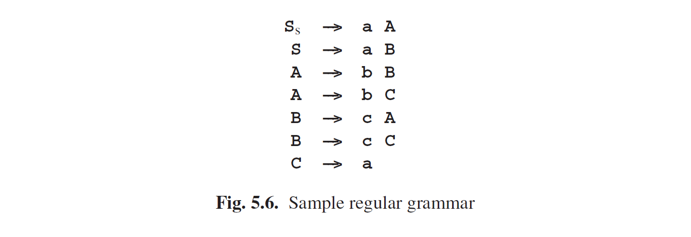
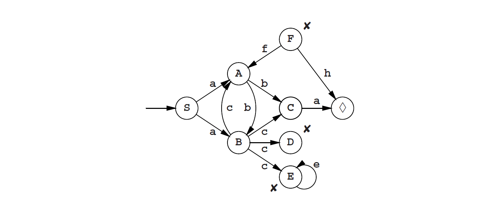

# 5.2 Producing from a Regular Grammar

When producing from a regular grammar, the producer needs to remember only one thing: which non-terminal is next. We shall illustrate this and further concepts using the simple regular grammar of Figure 5.6. This grammar produces sentences consisting of an a followed by an alternating sequence of bs and cs followed by a terminating a. For the moment we shall restrict ourselves to regular grammars in standard notation; further on we shall extend our methods to more convenient forms.

The one non-terminal the producer remembers is called its state and the producer is said to be in that state. When a producer is in a given state, for example A, it chooses one of the rules belonging to that state, for example A--->bC, produces the b and moves to state C. Such a move is called a state transition, and for a rule P→tQ is written P t→ Q. A rule without a non-terminal in the right-hand side, for example C--->a, corresponds to a state transition to the accepting state; for a rule P →t it is written P t→ ♦, where ♦ is the accepting state.

It is customary to combine the states and the possible transitions of a producer in a transition diagram. Figure 5.7 shows the transition diagram for the regular grammar of Figure 5.6; we see that, for example, the state transition A b→ C is represented by the arc marked b from A to C. S is the initial state and the accepting state is marked with a ♦ ^1. The symbols on the arcs are those produced by the corresponding move. The producer can stop when it is in an accepting state.

Like the non-deterministic automaton we saw in Section 3.3, the producer is an automaton, or to be more precise, a non-deterministic finite automaton, NFA or finite-state automaton, FSA. It is called “finite” because it can only be in a finite number of states (5 in this case; 3 bits of internal memory would suffice) and “nondeterministic” because, for example, in state S it has more than one way to produce an a.

Regular grammars can suffer from undefined, unproductive and unreachable nonterminals just like context-free grammars, and the effects are even easier to visualize. If the grammar of Figure 5.6 is extended with the rules 

we obtain the transition diagram

where we can see that no further transitions are defined from D, which is the actual meaning of saying that D is undefined; that E, although being defined, literally has no issue; and that F has no incoming arrows.

The same algorithm used for cleaning CF grammars (Section 2.9.5) can be used to clean a regular grammar. Unlike CF grammars, regular grammars and finite-state automata can be minimized: for a given FS automaton A, a FS automaton can be constructed that has the least possible number of states and still recognizes the same language as A. An algorithm for doing so is given in Section 5.7.

[1] Another convention to mark an accepting state is by drawing an extra circle around it; since we will occasionally want to explicitly mark a non-accepting state, we do not use that convention.