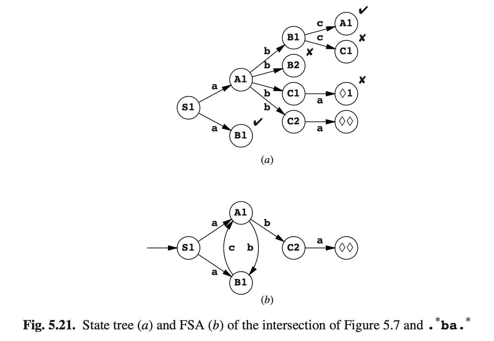

# 5.5 常规语言的操作

在第2.10节中，我们讨论了CF语言上的操作“union”，“intersection”，“negation”，并发现后面两种并不一定会产生CF语言。对于常规语言来说，情况更简单：这些常规语言的操作集合都可以得到常规语言。

为FS自动机A1和A2定义的两个联合常规语言创建一个FS自动机很简单：只需要创建一个新的起始状态，并将ε转换从该状态添加到A1和A2的起始状态。如果需要ε转换可以去掉，如5.3.1所述。

There is an interesting way to get the negation (complement) of a regular lan- guage L defined by a FS automaton, provided the automaton is ε-free. When an automaton is ε-free, each state t in it shows directly the set of tokens Ct with which an input string that brings the automaton in state t can continue: Ct is exactly the set of tokens for which t has an outgoing transition. This means that if the string contin- ues with a token which is not in Ct , the string is not in L, and so we may conclude it is in ¬L. Now we can “complete” state t by adding outgoing arrows on all tokens not in Ct and lead these to a non-accepting state, which we will call s−1. If we perform this completion for all states in the automaton, including s−1, we obtain a so-called complete automaton, an automaton in which all transitions are defined.

The complete version of the automaton of Figure 5.7 is shown in Figure 5.20, where the non-accepting state is marked with a ✘.

The importance of a complete automaton lies in the fact that it never gets stuck on any (finite) input string. For those strings that belong to the language L of the au- tomaton, it ends in an accepting state; for those that do not it ends in a non-accepting state. And this immediately suggests how to get an automaton for the complement (negative) of L: swap the status of accepting and non-accepting states, by making the accepting states non-accepting and the non-accepting states accepting!

Note that completing the automaton has damaged its error detection properties, in that it will not reject an input string at the first offending character but will process the entire string and only then give its verdict.

The completion process requires the automaton to be ε-free. This is easily achieved by making it deterministic, as described on page 145, but that may be overkill. See Problem 5.4 for a way to remove the ε-transitions only.

Now that we have negation of FSAs, constructing the intersection of two FSAs seems easy: just negate both automata, take the union, and negate the result, in an application of De Morgan’s Law p ∩ q = ¬((¬ p) ∪ (¬q)). But there is a hitch here. Constructing the negation of an FSA is easy only if the automaton is ε-free, and the union in the process causes two ε-transitions in awkward positions, making this “easy” approach quite unattractive.

Fortunately there is a simple trick to construct the intersection of two FS automata that avoids these problems: run both automata simultaneously, keeping track of their two states in one single new state. As an example we will intersect automaton A1, the automaton of Figure 5.7, with an FSA A2 which requires the input to con- **tain the sequence ba. A2 is represented by the regular expression . ba. . It needs 3 states, which we will call 1 (start state), 2 and ♦ (accepting state); it has the following [abc] b a [abc] transitions: 1 → 1, 1→2, 2→♦, ♦ → ♦.

We start the intersection automaton A1 ∩ A2 in the combined state S1, which is composed of the start state S of A1 and the start state 1 of A2. For each transition P1 →t Q1 in A1 and for each transition P2 →t Q2 in A2 we create a transition (P1P2) →t (Q1Q2) in A1 ∩ A2. This leads to the state tree in Figure 5.21(a); the corresponding FSA is in (b). We see that it is similar to that in Figure 5.7, except that the transition B→cC is missing: the requirement that the string should contain the sequence ba removed it.

In principle, the intersection of an FSA with n states and one with m states can require n × m states, but in practice something like c × (n + m) for some small value of c is more usual.

Conversely, sometimes a complex FSA can be decomposed into the intersection of two much simpler FSAs, with great gain in memory requirements, and sometimes it cannot. There is unfortunately little theory on how to do this, though there are some heuristics; see Problem 5.7. The process is also called “factorization”, but that is an unfortunate term, since it suggests the same uniqueness of factorization we find in integers, and the decomposition of FSAs is not unique.