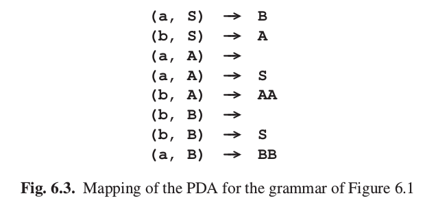
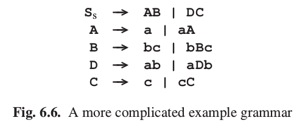

# 6.2 下推自动机(pushdown automaton)

在上面的例子中我们进行的步骤跟所谓的下推自动机很相似。下推自动机（PDA）是一个假想的数学装置，它读入输入串，用栈（stack）进行控制。栈内可以包含属于栈符号表（stack alphabet）的符号。栈是一种只能从一端被使用的列表：最后一个进入（“pushed”）列表的是第一个被取出（“popped”）的。栈有时被叫做先进先出表（first-in,last-out list 或 FILO list）：第一个进去的符号最后一个出来。在上面的例子中，预测的工作方式就像一个栈，这里就是下推自动机使用栈的地方。因此我们将这个栈称作预测栈（prediction stack）。同时，这个栈解释了术语“下推”自动机：为了后续过程，自动机在栈上“推入”符号。

下推自动机的工作方式是弹出一个栈符号然后读一个输入符号。接着这两个符号一般会给我们一个关于几种将被推入的栈符号列表的选择。所以存在一个（输入符号，栈符号）对到栈符号的列表的映射。在栈空并且达到输入符号尾的时候，自动机接受输入的句子。如果有多种选择（所以（输入符号，栈符号）映射到不止一个的列表上），自动机在存在一些选择使得读到句尾时栈空时接受句子。

这种自动机是以满足格雷巴赫范式（Gretbach Normal Form, GNF）的上下文无关语法为模型的。在这种范式中，所有语法规则都满足A&rarr;a或A&rarr;aB1B2...Bn,这里a是一个终结符，A,B1,...,Bn是非终结符。栈符号当然是终结符。A&rarr;aB1B2...Bn形式的规则对应着（a,A）对B1B2...Bn的映射。这意味着如果输入符号是a，预测栈栈顶是A，我们可以接受a，将预测栈上的A替代为B1B2...Bn。A&rarr;a对应着（a,A）向空列表的映射。开始时，这个自动机栈顶为语法的开始符号。每一个不产生空串的上下文无关语法都能转化为格雷巴赫范式（Greibach[8]）。大多数形式语言理论的书都讨论了如何做这项工作（例如见Hopcroft and Ullman[391]）。

图6.1的示例语法已经是格雷巴赫范式了，所以我们轻松的从它构建一个下推自动机。这个自动机在图6.3用映射的形式表示了出来。

这里有很重要的一点需要注意：很多下推自动机是非确定（non-deterministic）的。比如，图6.3所示的下推自动机可以为（a,A）选择空串或S。事实上，存在不能构建出确定的下推自动机的上下文无关语言，尽管我们能构建出非确定的。

还需要提及的是：这里我们讨论的下推自动机是自动机理论里的的简化版。在自动机理论里，下推自动机有状态（state），相应的映射是从（状态，输入符号，栈符号）三元组到（状态，栈符号列表）的二元组。从这个角度看，它们像是用一个栈拓展了的有限状态自动机（第五章讨论的）。而且，下推自动机有两种类型：一些用栈空表示接受句子，另一些用在标注为接受状态（accepting state）的状态处结束表示接受。也许这点会令人惊讶，拥有状态并不能让下推自动机这个概念更有力（powerful），有状态的下推自动机仍然只能接受可以被上下文无关语法描述的语言。在我们的讨论中，下推自动机只有一个状态，所以我们已经忽略它了。

如果我们想将其转化为解析用的自动机（parsing automata），以上描述的下推自动机有几个缺点需要克服。首先，下推自动机需要我们将我们的语法装华为格雷巴赫范式。虽然语法转换对形式语言学家不是问题，我们希望避免它们，尽量用原始的语法。现在我们稍微放宽格雷巴赫范式的要求，允许栈符号是终结符，然后对所有a，在映射中添加
(a,a)&rarr;
这样我们就能使用所有右侧都由非终结符开始的任何语法了。同时，我们可以将下推自动机的工作步骤分为“匹配”和“预测”，就像我们在6.1节中的例子那样做的。“匹配”步骤对应(a,a)&rarr;的使用，“预测”步骤对应(,A)&rarr;...，这个就是说，栈上的非终结符被它的一个右侧替代，不用消耗输入符哈皮。对图6.1所示语法，这样表时候的结果如图6.4所示，这事实上仅仅就是重写了图6.1的语法。

我们之后将会看到，即使用了这种方法，我们还是有可能必须改动语法，但现在这看起来非常有希望，所以我们采用这种策略。这个策略同时解决了另一个问题：ε规则不再需要特殊的处理了。为了得到格雷巴赫范式，我们要除去它们但是这不再需要了，因为它们刚好对应(,A)&rarr;

第二个缺点是这个下推自动机没有保存使用过的规则（映射）的记录。因此，我们在这个自动机中引入一个解析栈（analysis stack）。对每一个预测的步骤，我们将被替换的非终结符，以使用的右侧的序号（将右侧从1到n标上序号）为后缀推入解析栈。这样，解析栈刚好跟图6.2中虚线左边的部分对应，这个虚线表示了解析栈与预测栈的分隔。这导致了这个自动机在每个时候都有如图6.5所示结构。这个结构，跟当前状态，栈等等，被称作一个即时描述（instantaneous description）。在图6.5中，匹配过程可以本看作将竖直线向右推。

然而最重要的第三个缺点，是非确定性。形式上，这个自动机当且仅当有一个选择的序列使得在句尾的时候栈空接受句子，这个说法可能让人满意，但是对于我们的目的不是这样，因为这没有告诉我们怎么得到这个序列。我们必须引导自动机去做正确的选择。回看6.1节的例子，在推导的很多时候需要做出选择，而且我们的选择基于了一些对当前的语法的特殊的考虑：有时我们关注句子的下一个符号，也有时我们看得更远，去确定之后没有a出现。在这个例子里，选择是容易的，因为所有右侧由终结符开始。然而一般的，找到正确的选择要困难的多。比如右侧可以由一个非终结符开始，它又有从非终结符开始的右侧，等等。

在第八章我们将看到，给定句子的下一个符号，很多语法仍然允许我们决定使用哪一个右侧。但是在本章中，我们将关注能在更大一部分的语法上工作的自顶向下解析方法。而不是尝试基于特殊考虑来决定选择，我们要从所有可能出发来引导自动机。在第三章我们曾看到，在解决在特定的点有多种分支的问题的时候一般有两种方法：深度优先搜索和广度优先搜索。我们将看到如何完成这两种方法的机器操作。由于操作的步数可能会按输入规模以指数级别增长，即使是一个小例子也可能有庞大的作业量。为了让事情更有趣，我们将只用图3.4所示的固有歧义的语言，这个语法在图6.6这里重复了一遍。我们将用aabc作为测试输入。

