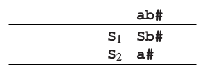
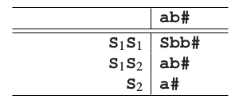

# 6.3.2 一个反例：左递归（Left recursion）

上述方法明显适用于那个语法，那么问题是它是否对所有上下文无关语法都适用呢？有的人可能认为是，因为在任何出现的预测里，对所有非终结符，所有可能都被有系统地尝试了。不幸的是，这个推理有个严重的缺点，这被下一个例子说明了：让我们看看句子ab是否属于这个简单语法定义的语言：
S&rarr;Sb | a
我们的自动机从下面的状态开始：

因为在预测的开始是一个非终结符，我们进行预测步骤，得到：

有一个预测再次以非终结符开始，我们再进行预测：

现在，很清楚发生了什么事：我们好像最终进行了一个无限的过程，什么都得不到。导致这样的原因是我们一直在尝试S&rarr;Sb规则，从未达到可以尝试匹配的状态。无论何时有一个非终结符能推导出无限多的由非终结符开始的句型，这个问题就会发生，进而没有匹配步骤会发生。因为这无限多的句型由非终结符开始，非终结符的数量又是有限的，就至少有一个非终结符在开头出现过超过一次。所以我们有：A&rarr;&hellip;&rarr;A&alpha;.一个能推导出由自己开始的句型的非终结符就叫做*左递归*。
左递归有几种类型：当有一个A&rarr;A&alpha;这样的语法规则，我们称为*直接左递归（immediate left recursion）*，就像规则S&rarr;Sb;当递归通过了其他规则，比如A&rarr;B&rarr;&alpha;,B&rarr;A&beta;，我们称为*间接递归（indirect left recursion）*。这些形式的左递归都可能被&epsilon;-产生式隐藏;这分别导致*隐藏左递归（hidden left recursion）*和*隐藏间接左递归（hidden indirect left recursion）*。比如在这个语法里

非终结符S,B,和都是左递归的。有左递归的非终结符的语法也叫做左递归。
如果一个语法没有&epsilon;规则也没有循环（loop），我们仍然可以使用我们的解析策略如果我们使用一个额外的步骤：如果一个预测栈有超过输入句子长度数量的符号，它不可能推导出输入句子（每一个非终结符推导出至少一个符号），所以它能被去掉。然而，这个小技巧有一个大弊端：它需要提前知道输入句子的长度，所以这个方法不再适用于在线解析。幸运的是，左递归能被消除：给定一个左递归语法，我们可以将它转化为一个定义相同语言，并且没有左递归非终结符的语法。我们将要讨论这个语法转化。
