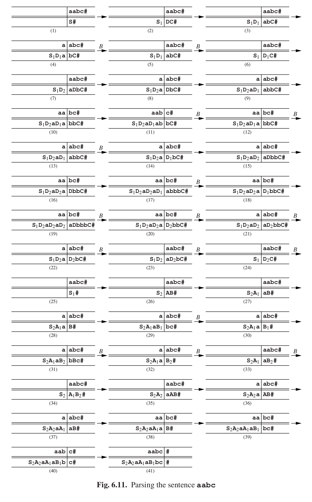

# 6.5 深度优先（回溯）解析器

上一节叙述的广度优先方法有一个缺点，它会占用大量内存。深度优先方法也有一个不足，它的一般形式不适用于在线解析。然而，有很多应用场景下不需要在线解析，于是深度优先方法就比较有利，因为它不需要大量内存。

在深度优先方法中，当我们面临多种可能选择时，选择一个，暂时搁置其他可能。首先，充分地检查我们的选择产生的结果。如果选择被证明是错误的（或者是成功的，但我想要全部的解），就回滚我们的操作直到现在的状态，然后用其他的可能选择继续。

让我们看看这个搜索技术是怎么应用于自顶向下解析的。我们的深度优先解析器遵循跟广度优先解析器一样的操作，直到遇到一个选择：预测栈顶的非终结符有超过一个右侧。现在，选择第一个右侧，而不是建立一个新的解析栈/预测栈。这个选择通过在涉及到的非终结符附上下标1,来反映到解析栈上，跟我们在广度优先解析器那做的一样。然而这次，解析栈不仅仅用作记录解析过程，还用作回溯。

解析器继续这个过程，直到发生匹配失败，或者终止记号成功匹配。如果预测栈是空的，我们就找到了一个解析，它被解析栈的内容所描述;如果匹配失败，解析器会回溯。这个回溯包含如下步骤：首先，解析栈顶的所有终结符出栈，并依次推入预测栈。并且，这些符号从已匹配输入中移出，并加在剩余输入的开始处。这是“匹配”步骤的逆操作。所以遍及终结符的回溯通过向后移动竖线完成，就像图6.9那样。 

 那么有两种可能：如果解析栈空，就没有其他可能可以尝试，解析结束;否则，解析栈顶是一个非终结符，并且预测栈顶对应了它的一个右侧。选择这个右侧导致了失败的匹配。这种情况下，我们从解析栈弹出这个非终结符，用它替换预测栈顶对应它的右侧的部分，就像图6.10那样。 

 接下来有两种可能：如果那是这个非终结符最后一个右侧，我们已经尝试过它的全部右侧，需要进一步回溯;如果不是，我们再次开始解析，首先用它的下一个右侧替换掉这个非终结符。

现在让我们尝试解析句子aabc，这次使用回溯解析器。图6.11一步步展示了这个过程;回溯步骤用B标注了出来。这个例子表露了回溯方法的另一个缺陷：它可能会做出错误的选择，在很久之后才会发现。

就像这里展示的，解析过程会在解析被找到的时候停止。如果我们想找到全部的解析，在终止记号匹配时，我们不应该停止。我们可以使用回溯来继续，就好像没有找到成功的解析，并且在每次匹配终止记号时记录下解析栈（它代表了解析过程）。最后，我们的解析栈变空，表示我们已经穷尽了所有可能，这时解析停止。

