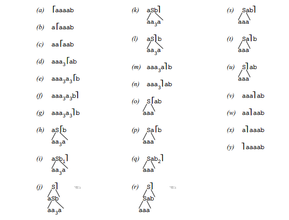

# 通过搜索解析
剩下的唯一问题是如何使自动机通过所有得可能性。该问题可容易的看成是搜索问题，它可以通过深度优先或广度优先搜索方法来解决。我们现在可以看到机器是如何使用这两种搜索方法的。由于结果在大小上是指数级别的，所以即使是最小的例子也会变得非常大，我们将在Figure 7.4中使用这种不切实际的语法。

Figure 7.4 展示目的的简单语法

Figure 7.5 深度优先解析的步骤

## 7.1.1 深度优先（回溯）解析
参考Figure 7.5，在图中，移动断点显示为⌈，而非移动断点显示为⌉。起初，断点位于整个输入的左侧（a），移动是唯一的选择；（b）和（c）同样如此。在（d）中，我们有意一个选择，移动或者使用规则3缩小；我们选择移动，但是要记得选择的缩小。规则编号显示为堆栈中符号的下标。（e）同理。在（f）中，我们移动失败，缩小失败（右侧不是aaaab，aab，ab或者b），并且没有存储的选择。所以我们开始通过反向移动来回溯（g）。这里我们发现了一个存储着的选择，“通过（规则）3缩小”，我们在（h）中应用，删除当前步骤中存储的选择的索引。现在我们可以再一次移动（i）。不可能再移动了，但是可以通过（规则）1缩小获得了一次解析（j）。享受成功后，我们不缩小了（k）；注意（k）仅仅在已经用过的选择1（规则1）上不同于（i）。反向移动，反缩小再反向移动带我们到了（n），这里我们找到了一个存储的选择，“通过规则3缩小”。缩小后（o），我们可以再一次移动，两次（p，q）。
